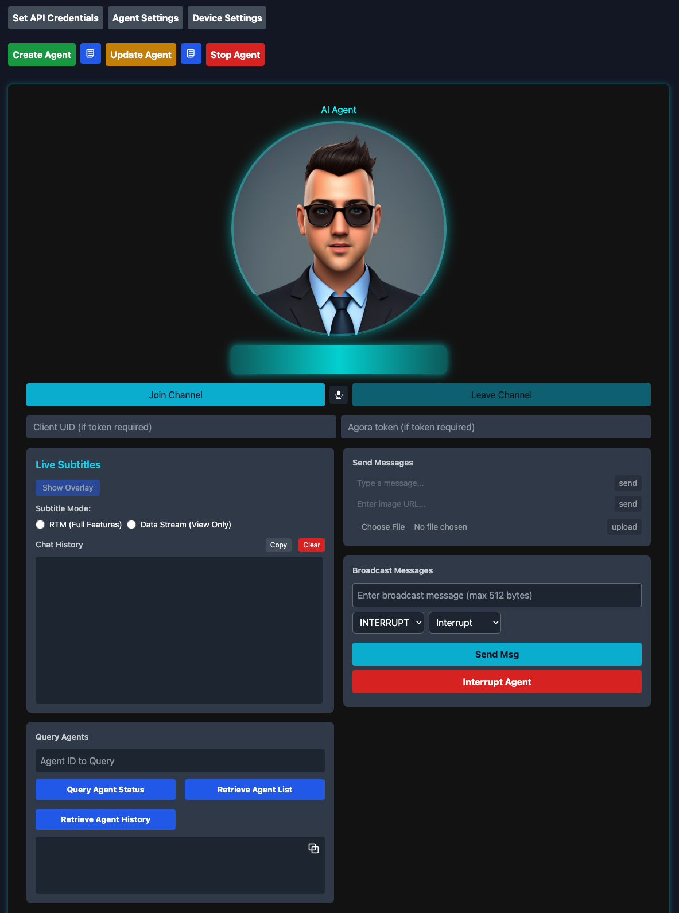
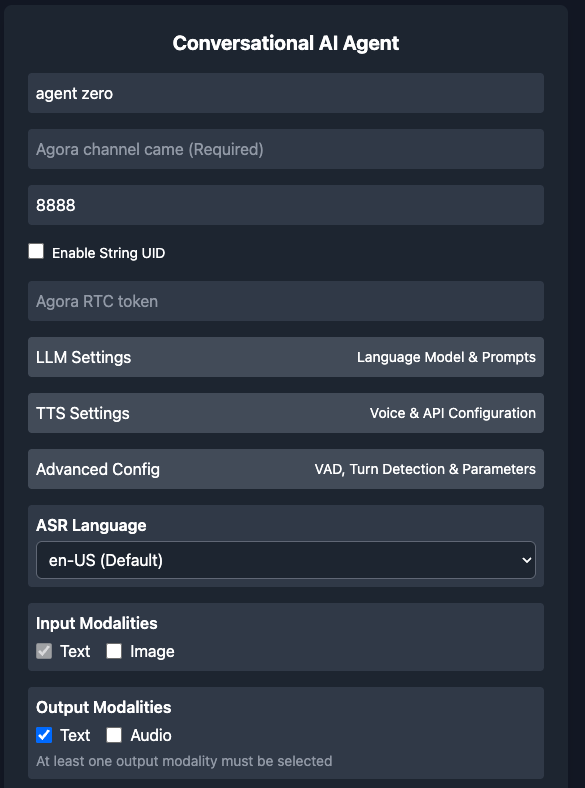
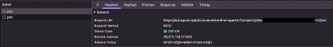
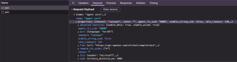
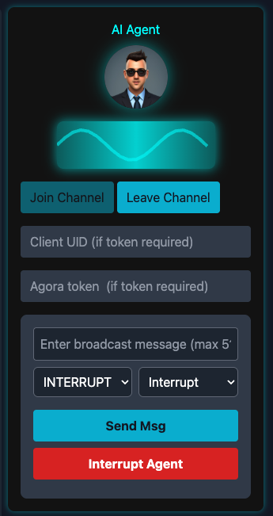

# Climb, Swing, Build: Exploring Agora's Convo AI Developer Jungle Gym

[

Are you ready to dive headfirst into the fascinating world of real-time conversational AI, but find yourself overwhelmed by complex setups and steep learning curves? What if you could easily experiment with powerful speech-to-text, text-to-speech, and even integrate sophisticated large language models (LLMs) to build dynamic, interactive AI conversations right in your browser?

Get ready to revolutionize your approach to conversational AI prototyping with the **Convo AI Developer Jungle Gym**! This isn't just another demo; it's a meticulously crafted web application designed to empower developers like you to effortlessly explore, test, and iterate on cutting-edge AI interactions. Built with a focus on simplicity and powerful integration, Convo AI Developer Jungle Gym provides a robust environment to bridge the gap between raw audio, transcribed text, synthesized speech, and the intelligent responses of an LLM, all in real-time.

---

## Why Agora's Conversational AI?

Agora's Conversational AI platform stands out by delivering real-time, natural language interactions that seamlessly fit into a variety of scenarios such as customer support, virtual assistants, interactive entertainment, and more. The Convo AI Playground showcases these capabilities vividly by giving developers an immediate, hands-on experience.

### Benefits of Using Agora's Conversational AI

- **Real-time response and feedback loops**  
- **Easy integration with leading AI services** (LLMs, TTS, and ASR)  
- **Scalable, secure APIs** for production-grade implementations  
- **Support for multiple TTS vendors** (Microsoft, ElevenLabs, Cartesia, OpenAI)
- **Advanced voice activity detection** and turn-taking control
- **Flexible input/output modalities** (text, audio, image)
- **Multimodal LLM support** with real-time communication ⭐ **NEW**
- **Comprehensive ASR integration** with multiple vendors ⭐ **NEW**
- **Advanced configuration options** for fine-tuned control ⭐ **NEW**

---

## Introducing Convo AI Playground

At Agora's recent internal hackathon, we set out with a clear goal: build something that lets developers experience the power of real-time conversational AI firsthand. No downloads. No backends. Just browser, code, and API keys.

The result is **Convo AI Playground** — a lightweight, frontend-only web tool that empowers developers to create and test real-time AI agent interactions using Agora's Conversational AI platform. The playground now supports **Agora ConversationalAI Backend v1.6**, which includes groundbreaking features like Multimodal LLM support, new TTS/ASR vendors, and advanced configuration options.

### What Is It?



Convo AI Playground is a browser-based control center for spinning up, managing, and testing real-time Conversational AI agents using Agora's RESTful API. The playground supports two distinct modes of operation:

#### Traditional LLM Mode
- Set up and manage conversational agents with advanced configuration options
- Interact with them in real-time — all from a single screen  
- Use Agora RTC to speak directly to the agent
- Monitor agent activity with real-time audio visualization
- Broadcast messages to agents with priority control
- Interrupt agent responses when needed
- View agent history and status
- Configure custom LLM parameters
- Choose between multiple TTS providers and voices
- Fine-tune voice activity detection settings

#### Multimodal LLM (MLLM) Mode ⭐ **NEW**
- Real-time multimodal conversations with OpenAI Realtime API
- Support for text, audio, and image inputs simultaneously
- Advanced turn detection with semantic VAD
- Automatic response generation and interruption handling
- Configurable conversation history management
- WebSocket-based real-time communication
- Camera integration for visual analysis

No backend or build system required — just enter your config, hit create, and start talking.

---

## Project Structure Breakdown

### `index.html` — Interface Layout



This file renders the interface where users:

- **Input Agora app credentials and token**  
- **Configure Conversational AI parameters**  
- **Choose between LLM and MLLM modes** ⭐ **NEW**
- **Choose TTS and ASR settings** with expanded vendor support
- **Join a voice channel** to speak with the AI agent
- **Set up LLM configuration** (model, API key, system messages)
- **Configure MLLM settings** (WebSocket URL, API key, conversation parameters) ⭐ **NEW**
- **Configure voice activity detection parameters**
- **Manage turn-taking behavior** with advanced options
- **Set up custom parameters** for advanced LLM control
- **Monitor agent status and history**
- **Broadcast messages and interrupt agent responses**
- **Configure camera integration** for image input ⭐ **NEW**
- **Set up advanced features** (AIVAD, RTM, silence management) ⭐ **NEW**

The interface is organized into collapsible sections for better organization:
- **LLM Settings** (disabled in MLLM mode)
- **TTS Settings** (disabled in MLLM mode)
- **MLLM Settings** ⭐ **NEW**
- **Advanced Configuration** ⭐ **NEW**
- **Custom Parameters**

---

### `api.js` — Agent Management via REST

  
*Creating an agent using the `/join` endpoint.*

  
*Updating or stopping an agent session through REST API calls.*

Defines the `AgoraAPI` class:

- `createAgent()`  
- `updateAgent()`  
- `stopAgent()`  
- `queryAgent()` / `listAgents()`
- `getAgentHistory()`
- `broadcastMessage()`
- `interruptAgent()`

Wraps RESTful interactions with Agora's agent endpoints, now supporting both traditional LLM and MLLM configurations.

---

### `ui.js` — Event Wiring and Form Behavior

- **Binds UI elements to behaviors**  
- **Handles credential input** and saves to localStorage  
- **Coordinates API interaction**
- **Manages collapsible configuration sections**
- **Handles TTS vendor-specific UI elements** with expanded vendor support
- **Populates voice selection dropdowns**
- **Manages custom parameter fields**
- **Handles broadcast message and interrupt functionality**
- **Manages MLLM mode switching** and configuration ⭐ **NEW**
- **Handles camera device selection** and configuration ⭐ **NEW**
- **Manages advanced feature toggles** (AIVAD, RTM, turn detection) ⭐ **NEW**

Keeps the interface in sync with agent settings across both LLM and MLLM modes.

---

### `audio.js` — Remote Audio Visualization



Defines `MediaProcessor`:

- **Uses Web Audio API for frequency analysis**  
- **Draws real-time waveform and volume ring**
- **Provides visual feedback for agent voice activity**
- **Supports multiple audio vendors** and configurations

Provides visual feedback from the agent's voice, now enhanced with support for MLLM audio streams.

---

### `utils.js` — Form and Configuration Helpers

The `Utils` class:

- **Manages localStorage credentials**  
- **Parses config form into API payloads**  
- **Validates required fields**
- **Handles custom parameter management**
- **Builds agent configuration objects**
- **Manages JSON export functionality**
- **Validates input/output modality combinations**
- **Supports MLLM configuration building** ⭐ **NEW**
- **Handles advanced feature configuration** ⭐ **NEW**

Ensures complete and correct agent configuration for both traditional LLM and MLLM modes.

---

## Broadcasting and Interrupting the AI Agent

The Convo AI Playground provides robust real-time control over agent behavior through its **Broadcast** and **Interrupt** features. These are accessible via the AI Agent widget in the UI and are directly mapped to backend API endpoints for advanced integration and automation.

### Broadcast Message

Broadcasting allows you to send custom messages to an agent in real time, with fine-grained control over how the message is handled.

**UI Workflow:**
- Enter your message in the "Enter broadcast message" field (max 512 bytes).
- Select the message **priority**:
  - `INTERRUPT`: Interrupts the agent's current response to process the new message immediately.
  - `APPEND`: Queues the message to be processed after the current response completes.
  - `IGNORE`: Discards the message if the agent is currently busy.
- Select **interruptability**:
  - `Interrupt`: The message can interrupt the agent.
  - `No Interrupt`: The message will not interrupt ongoing responses.
- Click **Send Msg** to broadcast the message to the agent.

**API Mapping:**
- `POST /api/conversational-ai-agent/v2/projects/{appId}/agents/{agentId}/broadcast`
- Payload includes:
  - `text`: The message content
  - `priority`: One of `INTERRUPT`, `APPEND`, `IGNORE`
  - `interruptable`: Boolean flag for interrupt behavior

### Interrupt Agent

The **Interrupt Agent** feature allows you to immediately halt the agent's current response, regardless of its state.

**UI Workflow:**
- Click the **Interrupt Agent** button to send an interrupt command to the agent.
- The agent will stop its current response and become ready for new input.

**API Mapping:**
- `POST /api/conversational-ai-agent/v2/projects/{appId}/agents/{agentId}/interrupt`
- No payload required; the agent is signaled to stop its current action.

### Technical Notes
- Both features provide real-time feedback in the UI regarding success or error status.
- Broadcast and interrupt operations are essential for building responsive, interactive, and user-driven conversational AI experiences.
- These controls can be automated or scripted via the API for advanced use cases (e.g., programmatic agent orchestration, live event control, or multi-agent coordination).

---

## New Features in Agora ConversationalAI Backend v1.6

### Multimodal LLM (MLLM) Support ⭐ **NEW**

The most significant addition in v1.6 is support for Multimodal Large Language Models through OpenAI's Realtime API:

#### Key Capabilities
- **Real-time WebSocket Communication**: Direct connection to OpenAI Realtime API for streaming conversations
- **Multimodal Input Processing**: Simultaneous handling of text, audio, and image inputs
- **Advanced Turn Detection**: Server VAD and Semantic VAD for context-aware conversation flow
- **Automatic Response Generation**: Configurable response creation and interruption handling
- **Conversation History Management**: Configurable message history (default: 32 messages)

#### Configuration Options
- **WebSocket URL**: Direct connection to OpenAI Realtime API
- **API Key**: Authentication for OpenAI services
- **Greeting Message**: Automatic greeting for first user in channel
- **Vendor Selection**: Currently supports OpenAI Realtime API
- **History Length**: Configurable conversation memory (minimum: 1 message)

### Enhanced TTS Vendor Support ⭐ **NEW**

Agora ConversationalAI Backend v1.6 adds two new TTS vendors to the existing Microsoft and ElevenLabs support:

#### Cartesia TTS
- **Ultra-fast, low-latency text-to-speech** with real-time streaming capabilities
- **Sonic-2 model** with custom voice configuration
- **Required fields**: API Key, Model ID (default: "sonic-2"), Voice ID
- **Voice configuration**: Uses object structure with `mode: "id"` and `id: "<voice_id>"`

#### OpenAI TTS
- **High-quality neural voice synthesis** with multiple voice options
- **Voice options**: coral, alloy, echo, fable, onyx, nova, shimmer
- **Required fields**: API Key, Model (default: "gpt-4o-mini-tts"), Voice (default: "coral")
- **Optional parameters**: Instructions for voice control, Speed (0.25-4.0)

### Comprehensive ASR Integration ⭐ **NEW**

Agora ConversationalAI Backend v1.6 expands ASR support beyond the built-in Agora ASR:

#### Microsoft ASR
- **High-accuracy speech recognition** with comprehensive language coverage
- **Required fields**: API Key, Region, Language
- **Language support**: Extensive language coverage based on Microsoft Speech Services
- **Region selection**: 30+ global regions for optimal performance

#### Deepgram ASR
- **Real-time streaming speech recognition** with advanced models
- **Required fields**: API Key, URL (default: "wss://api.deepgram.com/v1/listen"), Model (default: "nova-2"), Language (default: "en")
- **Model options**: nova-2, nova, enhanced, base
- **Multi-language support** with custom URL configuration

### Advanced Configuration Options ⭐ **NEW**

#### Turn Detection & VAD
- **Multiple VAD Types**:
  - Agora VAD: Built-in voice activity detection
  - Server VAD: Server-side processing (MLLM + OpenAI only)
  - Semantic VAD: Context-aware detection (MLLM + OpenAI only)

- **Configurable Parameters**:
  - Interrupt duration: Time before interruption triggers (default: 160ms)
  - Prefix padding: Forward padding for speech capture (default: 800ms)
  - Silence duration: Time before assuming speech end (default: 640ms)
  - Threshold: Voice detection sensitivity (0.0-1.0, default: 0.5)

- **MLLM-Specific Options**:
  - Create Response: Auto-generate response on VAD stop
  - Interrupt Response: Auto-interrupt ongoing responses
  - Eagerness: Response timing control (low, auto, high)

#### Advanced Features
- **AIVAD (AI Voice Activity Detection)**: Intelligent interruption handling (English only)
- **RTM (Real-Time Messaging)**: Advanced signaling service for custom data delivery
- **Metrics Collection**: Performance monitoring and error message handling
- **Data Channel Configuration**: Choice between RTC datastream and RTM

#### Silence Management
- **Configurable Timeout**: Maximum silent duration (0-60000ms)
- **Action Types**: speak (TTS announcement) or think (LLM context)
- **Custom Messages**: Personalized silence reminder content

### Camera Integration

The frontend application includes camera support for image input:

#### Capabilities
- **Periodic Screenshots**: Automatic image capture for analysis
- **Multi-camera Support**: Device selection and switching
- **Privacy Controls**: User acknowledgment and consent management
- **Image-based Analysis**: Sends periodic images to the model (not video streaming)

#### Configuration
- **Device Selection**: Choose from available camera devices
- **Privacy Acknowledgment**: User consent for camera access
- **Integration**: Seamless integration with MLLM image analysis

### Enhanced Input/Output Modalities

The frontend application supports expanded input/output modalities:

#### Input Modalities
- **Text Input**: Always enabled for all modes
- **Audio Input**: Real-time audio processing with multiple ASR vendors
- **Image Input**: Camera integration for visual analysis (MLLM mode)

#### Output Modalities
- **Text Output**: Rich formatting and display
- **Audio Output**: Vendor-specific synthesis with advanced parameters
- **Multi-modal Responses**: Combined text and audio in MLLM mode

### Improved Developer Tools ⭐ **NEW**

#### Configuration Management
- **Enhanced JSON Export**: Separate create and update configurations
- **Custom Parameter Types**: Support for string, number, boolean, array, and object types
- **Validation**: Improved form validation and error handling
- **Copy Functionality**: One-click configuration copying

#### Real-time Monitoring
- **Agent Status Tracking**: Enhanced status monitoring and display
- **Conversation History**: Detailed conversation retrieval
- **Performance Metrics**: RTM-enabled metrics collection
- **Error Handling**: Comprehensive error message collection and display

---

## Try It Yourself

### Use the Hosted Version

👉 [Visit](https://frank005.github.io/convo_ai)

### Run Locally

```bash
git clone https://github.com/frank005/convo_ai.git
cd convo_ai
run npx serve
```
Then, open the localhost page that is served in your browser.

### Key Features to Try

#### Traditional LLM Mode
1. **Multiple TTS Providers**
   - Microsoft TTS with region and voice selection
   - ElevenLabs integration with model and voice options
   - Cartesia TTS for ultra-fast synthesis ⭐ **NEW**
   - OpenAI TTS with neural voice options ⭐ **NEW**

2. **Advanced Voice Control**
   - Configure VAD parameters (threshold, silence duration)
   - Set up turn-taking behavior (interrupt, append, ignore)
   - Monitor voice activity with real-time visualization

3. **LLM Configuration**
   - Choose your preferred LLM model
   - Set system messages and parameters
   - Configure custom parameters for advanced control

4. **Agent Management**
   - Create, update, and stop agents
   - Query agent status and history
   - Broadcast messages with priority control
   - Interrupt agent responses when needed

#### Multimodal LLM Mode ⭐ **NEW**
1. **Real-time Multimodal Conversations**
   - Enable MLLM mode for advanced interactions
   - Configure OpenAI Realtime API connection
   - Experience simultaneous text, audio, and image processing

2. **Advanced Turn Detection**
   - Test Server VAD and Semantic VAD
   - Configure eagerness levels for response timing
   - Experience automatic response generation and interruption

3. **Camera Integration**
   - Enable image input for visual analysis
   - Configure camera device selection
   - Experience multimodal conversations with visual context

#### Enhanced Configuration
1. **Advanced Features**
   - Enable AIVAD for intelligent interruption handling
   - Configure RTM for advanced signaling
   - Set up silence management with custom messages

2. **Comprehensive ASR**
   - Test Microsoft ASR with multiple languages
   - Experience Deepgram ASR with advanced models
   - Compare performance across different vendors

3. **Developer Tools**
   - Export JSON configurations for create and update operations
   - Use custom parameters for advanced model control
   - Monitor agent performance with enhanced metrics

---

**Agora ConversationalAI Backend v1.6** - A comprehensive update bringing multimodal conversations, advanced configuration options, new TTS/ASR vendors, and enhanced developer tools to the Convo AI Developer Jungle Gym.