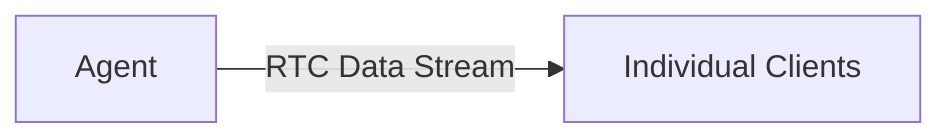
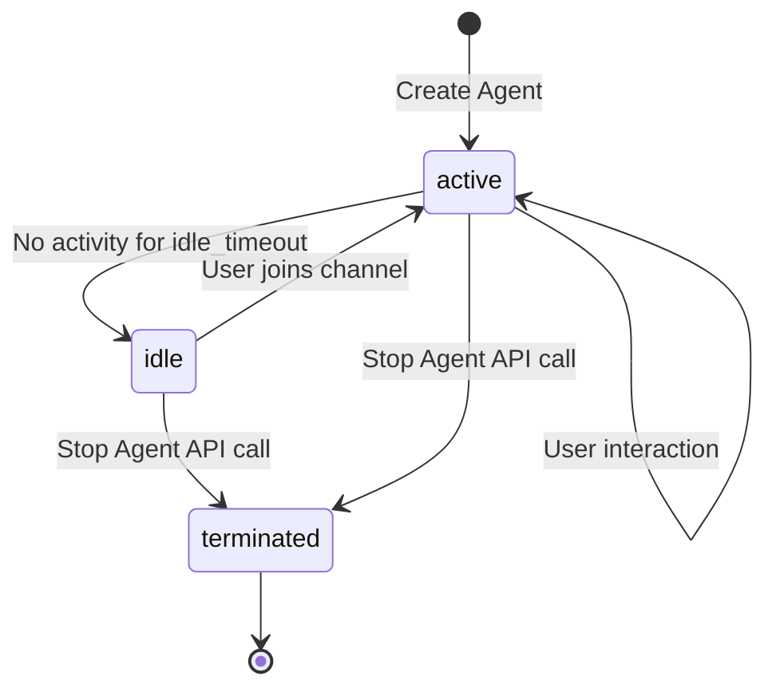

# Building Real-Time Voice AI Agents with Agora

Building a voice AI agent? The hard part isn't the LLM—it's the audio pipeline.

You need WebRTC for real-time audio streaming. ASR to transcribe speech. Coordination logic to know when the user stopped talking. LLM integration that maintains conversation context. TTS to synthesize responses. Streaming the audio back without introducing latency. Handling interruptions. Managing state transitions. Every piece needs to work in real-time or the conversation feels broken.

Agora's Conversational AI Engine handles the orchestration. You provide API keys for ASR (Microsoft, Deepgram, or use Agora's built-in), TTS (Microsoft, ElevenLabs, OpenAI, etc), and your LLM endpoint. Agora's infrastructure manages the RTC audio streaming, coordinates the ASR→LLM→TTS pipeline, handles voice activity detection, manages interruptions, and keeps everything synchronized. The services themselves are still separate APIs you configure, but you don't build the coordination layer or audio infrastructure.

I built this playground as a browser interface to experiment with different configurations. You can wire up any LLM, test different ASR/TTS providers, configure conversation behaviors, tune VAD parameters—without writing audio streaming code. This guide focuses on configuration: what works, what doesn't, and why.


_The Convo AI Playground interface provides a complete control center for managing conversational AI agents._

## How It Works

The playground splits cleanly into three layers: browser client, Agora's infrastructure, and your LLM. Keeping the audio pipeline entirely within Agora's infrastructure is what makes sub-second latency possible.

```mermaid
graph TB
    subgraph Browser["Browser Client"]
        MIC[Microphone] --> RTC_SDK[Agora RTC SDK]
        RTC_SDK --> RTC_CH[RTC Channel]
        RTC_CH --> RTC_SDK
        RTC_SDK --> SPEAKER[Speaker]
        RTM_SDK[RTM Client] --> RTM_CH[RTM Channel]
        RTM_CH --> RTM_SDK
    end

    subgraph Agora["Agora Infrastructure"]
        RTC_CH --> AGENT[Conversational AI Agent]
        AGENT --> RTC_CH
        AGENT --> ASR[ASR Engine]
        ASR --> LLM_PROXY[LLM Proxy]
        LLM_PROXY --> LLM[LLM API]
        LLM --> LLM_PROXY
        LLM_PROXY --> TTS[TTS Engine]
        TTS --> AGENT
        AGENT --> RTM_CH
    end

    style AGENT fill:#333,stroke:#f9f,stroke-width:4px
    style LLM fill:#333,stroke:#bbf,stroke-width:2px
```



**Browser Layer**

The browser uses Agora's RTC SDK to handle media streams. It joins an RTC channel, publishes microphone audio, and subscribes to agent audio. For transcription, it connects to an RTM channel for live captions. All the WebRTC complexity—codec negotiation, packet loss recovery, jitter buffering—stays in the SDK.

**Agora's Infrastructure**

The agent lives here. It subscribes to the RTC channel and receives user audio, runs it through ASR (Agora's built-in, Microsoft, or Deepgram), posts the transcribed text plus conversation history to your LLM endpoint, converts the response to audio via TTS, and streams it back through the RTC channel. The agent keeps a rolling buffer of conversation history (32 messages by default) and sends the full context with every LLM request.

**Your LLM**

Sits outside Agora's network entirely. The agent makes standard HTTPS API calls with conversation context and gets back text. This separation is useful—you can swap LLM providers, add middleware, inject dynamic context, without touching the audio pipeline.

### Key Components

I've structured the playground as a set of focused modules. Each one does exactly one thing, which makes debugging and adding new features much easier.

```
convo_ai/
├── src/js/
│   ├── api.js                    # Agora REST API client
│   ├── utils.js                  # Configuration builders
│   ├── conversational-ai-api.js  # RTM transcription handler
│   ├── audio.js                  # Audio visualization
│   ├── subtitles.js              # Live captions
│   └── ui.js                     # UI orchestration
└── index.html                    # Main interface
```

**`api.js`** - The REST API Layer

This module is your interface to Agora's Conversational AI APIs. Every interaction with the agent lifecycle goes through here:

```javascript
// Core agent lifecycle
await api.createAgent(customerId, customerSecret, agentConfig);
await api.updateAgent(customerId, customerSecret, agentId, updatePayload);
await api.stopAgent(customerId, customerSecret, agentId);

// Monitoring and control
await api.queryAgent(customerId, customerSecret, agentId);
await api.listAgents(customerId, customerSecret);
await api.broadcastMessage(
  customerId,
  customerSecret,
  agentId,
  text,
  priority,
  interruptable
);
await api.interruptAgent(customerId, customerSecret, agentId);
```

Why separate these into a dedicated module? Two reasons. First, authentication happens at the API boundary—every request needs proper credentials and encoding. Second, error handling for network operations differs from UI logic. Keeping them separate makes both testable.

**`utils.js`** - Configuration Management

Here's a problem I ran into early: the agent configuration object has nested structures several levels deep. ASR config lives under `properties.asr`, TTS config under `properties.tts`, LLM config under `properties.llm`, and advanced features under `properties.advanced_features`. If you hand-write this JSON every time, you _will_ make mistakes. I did, repeatedly.

So I built `utils.js` to handle the transformation from form inputs to valid agent configuration:

```javascript
// Extract form data
const formData = Utils.getFormData();

// Validate required fields
Utils.validateFormData(formData);

// Build ASR configuration
const asrConfig = Utils.buildAsrConfig(formData);

// Build complete agent configuration
const customParams = Utils.getCustomParams();
const agentConfig = Utils.buildAgentConfig(formData, customParams);
```

The builder pattern validates required fields upfront (no point hitting the API if you're missing your LLM key), handles type conversions (form inputs are strings, the API wants numbers), and provides defaults so you're not constantly checking "did they set temperature or should I use 1.0?"

This turned out to be more important than I expected. Agora's API is flexible, which means there are dozens of ways to misconfigure it. Centralizing the logic gives you one place to encode rules like "RTM mode requires `data_channel` set to 'rtm' and transcript enabled." Without this, you'd waste hours debugging malformed requests that fail silently.

**`conversational-ai-api.js`** - Real-Time Transcription

Transcription turns out to be more nuanced than "just show what the agent says." When you enable RTM transcription, the agent publishes multiple message types: temporary transcriptions (what ASR thinks you're saying mid-utterance), final transcriptions (confirmed text after you finish speaking), agent state changes (listening, thinking, speaking), and error notifications.

The `conversational-ai-api.js` module wraps Agora's RTM SDK to handle this complexity:

```javascript
// Initialize the API with RTM and RTC engines
ConversationalAIAPI.init({
  rtcEngine: agoraRTCClient,
  rtmEngine: agoraRTMClient,
  renderMode: 'text',
  enableLog: true,
  expectedAgentId: 'my-agent',
});

// Subscribe to transcription updates
const api = ConversationalAIAPI.getInstance();
api.on(EConversationalAIAPIEvents.TRANSCRIPTION_UPDATED, (chatHistory) => {
  // Handle transcription updates
  chatHistory.forEach((message) => {
    console.log(`${message.data.speaker}: ${message.data.text}`);
  });
});

// Subscribe to channel messages
await api.subscribeMessage(channelName);
```

Under the hood, `CovSubRenderController` handles deduplication. ASR engines send incremental updates—you get "Hello", then "Hello how", then "Hello how are", then finally "Hello how are you" as the user speaks. Without deduplication, your UI shows four separate messages instead of one updating line.

The controller tracks message IDs and timestamps to distinguish temporary from final transcriptions. When a final version arrives, it replaces all the temporary ones with the same base ID. Users see smooth, real-time captions instead of rapidly stuttering text.

The agent also publishes state transitions—listening, thinking, speaking—through RTM. You can use these for UI feedback: a thinking spinner, a visual indicator that the agent is currently talking, whatever fits your interface.

**`audio.js`** - Audio Visualization

You need visual feedback in voice interfaces. Without it, users don't know if the agent is speaking, if their microphone is working, or if the system is frozen. The `MediaProcessor` class handles both RTC connection management and real-time audio visualization:

  
_Real-time waveform and volume ring visualization provides immediate feedback on agent voice activity._

```javascript
// Setup audio processing with Web Audio API
async setupAudioProcessing(remoteAudioTrack) {
  this.audioContext = new (window.AudioContext || window.webkitAudioContext)();
  this.analyser = this.audioContext.createAnalyser();
  this.analyser.fftSize = 256;
  const bufferLength = this.analyser.frequencyBinCount;
  this.dataArray = new Uint8Array(bufferLength);

  const mediaStream = new MediaStream([remoteAudioTrack.getMediaStreamTrack()]);
  const source = this.audioContext.createMediaStreamSource(mediaStream);
  source.connect(this.analyser);

  this.visualizeAudio();
}

// Real-time visualization using FFT frequency data
visualizeAudio() {
  const canvas = document.getElementById("audio-wave");
  const ctx = canvas.getContext("2d");

  const drawWave = () => {
    requestAnimationFrame(drawWave);
    this.analyser.getByteFrequencyData(this.dataArray);
    let averageVolume = this.dataArray.reduce((a, b) => a + b, 0) / this.dataArray.length;
    let volumeLevel = averageVolume / 128;

    // Draw waveform
    ctx.clearRect(0, 0, canvas.width, canvas.height);
    ctx.beginPath();
    for (let i = 0; i < canvas.width; i += 10) {
      let height = Math.sin(i * 0.05) * volumeLevel * 50;
      ctx.lineTo(i, canvas.height / 2 - height);
    }
    ctx.strokeStyle = `rgba(0, 255, 255, ${0.3 + volumeLevel * 0.7})`;
    ctx.lineWidth = 4;
    ctx.stroke();
  };

  drawWave();
}
```

The visualization taps into the Web Audio API's AnalyserNode. As audio streams through the RTC connection, the analyzer runs FFT (Fast Fourier Transform) on the buffer, giving you frequency domain data. Higher frequencies map to taller bars. Simple, intuitive feedback about audio activity.

In testing, users couldn't tell when to speak without this visual cue. They'd interrupt the agent mid-sentence or sit in awkward silence waiting for a response that had already started. The waveform fixes this—when it's animating, the agent is speaking. When it's flat, the floor is yours.

Bonus: when audio breaks, the waveform immediately shows you which side failed. Flat while you're speaking? Mic permissions. Flat when the agent should be responding? RTC subscription issue.

**`subtitles.js`** - Live Caption System

Transcription is one of those features that seems simple until you implement it. The `SubtitleManager` handles two distinct architectures, each with different tradeoffs:

**RTM Mode** requires RTM signaling enabled on your Agora AppID. This gives you pub/sub messaging with guaranteed delivery, message receipts, and the ability to broadcast messages to all participants. When the agent transcribes speech, it publishes to an RTM channel that all clients subscribe to. You get bidirectional transcription (both user and agent speech), status updates, and the ability to inject context via broadcast messages.

```mermaid
graph LR
    A1[Agent] -->|Publishes| B1[RTM Channel]
    B1 -->|Delivers| C1[All Clients]
    C1 -->|Receipt Ack| B1

    style B1 fill:#333,stroke:#afa,stroke-width:2px
```



**Data Stream Mode** uses RTC data streams—essentially, data packets piggy-backed onto the RTC connection. Simpler setup (no RTM configuration), and you get bidirectional transcription (both user and agent speech) plus agent state events. However, it lacks message sending capabilities, metrics, error notifications, and message receipts. This works fine for single-user scenarios but doesn't scale to multi-party conversations.



Both modes face the same deduplication challenge I mentioned earlier. ASR engines send incremental updates, and you need logic to coalesce them into coherent sentences. The `SubtitleManager` maintains a message history buffer, tracks message IDs, and replaces temporary transcriptions with final ones. It also handles the chat history UI—scrolling, speaker labels, timestamps—so you're not reinventing that wheel.

## LLM Configuration

Your agent's personality and intelligence live in the LLM. The architecture works with any LLM that accepts HTTP requests—Anthropic, OpenAI, Gemini, custom providers, whatever.

### Get an API Key

1. Create an account with your chosen LLM provider (Anthropic, OpenAI, Google, etc.)
2. Navigate to the API Keys section
3. Generate a new API key
4. Keep it secure—you'll need it for the LLM configuration

Standard API onboarding. Don't commit the key to version control. The playground stores it in localStorage for convenience, but production apps should proxy LLM calls through your backend.

### Configure the Endpoint

**LLM URL**: The API endpoint for your chosen provider, for example:
- Anthropic: `https://api.anthropic.com/v1/messages`
- OpenAI: `https://api.openai.com/v1/chat/completions`
- Google Gemini: `https://generativelanguage.googleapis.com/v1/models/{model}:generateContent`
- Or your custom LLM endpoint

**API Key**: Your LLM provider's API key

**Model**: Choose your model based on your latency and quality requirements. For voice conversations, you need fast responses without sacrificing quality. Balance response time (~2-3 seconds ideal) with reasoning capabilities. Faster models work great for simple conversations, while more capable models handle complex tasks better but may introduce latency.

### System Messages

The system message defines personality and capabilities:

```
You are a helpful AI voice assistant. Keep responses concise since they will be spoken aloud.
Avoid lengthy explanations unless specifically asked. Use natural conversational language.
```

This matters more than you might expect. Many LLMs' default behavior is optimized for written communication—detailed, thorough, often lengthy. That works great in text chat where users can skim. In voice, verbosity kills the experience. Users can't skim audio. They have to listen to every word.

Early iterations often produce comprehensive, well-structured answers that sound robotic when spoken. "To answer your question, I'll first explain the background context, then provide three key points, and finally offer a conclusion." Nobody talks like that. The system message needs to explicitly instruct: be conversational, be brief, sound human.

Some patterns that work:

Set explicit length limits ("Keep responses under 50 words unless asked for details"). Define personality directly ("You're friendly but professional" vs. "You're casual and playful"). Handle edge cases upfront ("If you don't know something, say so directly instead of hedging"). Avoid written formats ("No lists or bullet points—speak in natural sentences").

**Greeting Message**: What the agent says when the first user joins the channel.

```
Hello! I'm your AI assistant. How can I help you today?
```

This fires automatically on channel join. Keep it short and inviting. Users are already dealing with the cognitive load of starting a voice conversation—don't overwhelm them with a lengthy introduction.

**Failure Message**: What the agent says when encountering errors (LLM timeout, API errors, invalid responses).

```
I'm sorry, I'm having trouble processing that right now. Could you try again?
```

You want this message to be apologetic but not alarming. "Something went wrong with my language model endpoint" is technically accurate but creates user anxiety. "I'm having trouble" is softer and more human.

### Custom Parameters

Most LLM APIs need additional parameters beyond Agora's standard config. Add these via Custom Parameters:

**max_tokens** (`number`, typically `1024`): Limits response length. 1024 tokens (~800 words) balances detail against voice constraints. Lower values (512) speed things up but truncate complex answers. Higher values (2048+) increase latency and cost.

**temperature** (`number`, typically `1.0`): Controls randomness. 1.0 gives natural variety. Lower (0.7) produces deterministic, focused responses but feels repetitive. Higher (1.2+) increases creativity at the cost of coherence.

**stop_sequences** (`array`, optional): Tells the LLM when to stop generating. Useful for preventing the model from simulating multi-turn exchanges in a single response.

Check your LLM provider's docs for what's required.

### Request Format

Agora constructs requests in the format your provider expects. Most modern LLMs use a similar message-based structure:

```json
{
  "model": "your-chosen-model",
  "max_tokens": 1024,
  "temperature": 1.0,
  "system": "You are a helpful AI voice assistant...",
  "messages": [
    { "role": "user", "content": "What's the weather like today?" },
    {
      "role": "assistant",
      "content": "I don't have access to real-time weather data."
    },
    { "role": "user", "content": "Can you tell me a joke instead?" }
  ]
}
```

The agent maintains conversation context automatically by appending to the `messages` array. The `max_history` parameter (default: 32 messages) controls buffer size. Each message consumes context window tokens—32 messages typically represents 5-10 conversation turns while leaving headroom for system messages and response generation.

**Context Window Management:**

Modern LLMs have varying context window sizes (ranging from 8K to 200K+ tokens). Practical limits depend on your specific model. Consider:

- System message: ~100-500 tokens
- Conversation history (32 messages): ~2,000-8,000 tokens depending on verbosity
- Response generation: 1,024 tokens (as configured)
- Working buffer: ~10-20% overhead for formatting

For most voice applications, 32 message history is sufficient. Reduce to 16 for short Q&A interactions. Increase to 64+ for complex, context-dependent conversations (technical support, tutoring).

## Complete Configuration Example

Here's a working configuration for an LLM-powered agent:

  
_The agent configuration form allows you to set up all aspects of your conversational AI agent, from LLM settings to TTS voice selection._

**Agent Settings:**

- Unique Name: `claude-assistant-001`
- Channel Name: `my-voice-channel`
- Agent RTC UID: `8888` (arbitrary but should be consistent)
- Remote RTC UIDs: `*` (allows any user to talk to the agent)
- Idle Timeout: `300` (agent stops after 5 minutes of inactivity)

**LLM Configuration:**

- Provider: Your chosen LLM provider
- URL: Your LLM API endpoint (e.g., `https://api.anthropic.com/v1/messages` or `https://api.openai.com/v1/chat/completions`)
- API Key: Your actual API key
- Model: Your chosen model
- System Message:
  ```
  You are Emma, a friendly AI assistant who helps users with their questions.
  Speak naturally and conversationally. Keep responses under 50 words unless
  the user asks for detailed explanations.
  ```
- Greeting: `Hi, I'm Emma! What can I help you with?`
- Max History: `32`

**Custom Parameters:**

```json
{
  "max_tokens": 1024,
  "temperature": 1.0
}
```

Note: Adjust parameters based on your LLM provider's API requirements.

**TTS Configuration:**

Agora supports multiple TTS vendors (playground dropdown):

- [Microsoft Azure TTS](https://docs.agora.io/en/conversational-ai/models/tts/microsoft)
- [ElevenLabs TTS](https://docs.agora.io/en/conversational-ai/models/tts/elevenlabs)
- [MiniMax TTS](https://docs.agora.io/en/conversational-ai/models/tts/minimax)
- [Deepgram TTS](https://docs.agora.io/en/conversational-ai/models/tts/deepgram)
- [Murf TTS](https://docs.agora.io/en/conversational-ai/models/tts/murf)
- [Cartesia TTS](https://docs.agora.io/en/conversational-ai/models/tts/cartesia)
- [OpenAI TTS](https://docs.agora.io/en/conversational-ai/models/tts/openai)
- [Hume AI TTS](https://docs.agora.io/en/conversational-ai/models/tts/hume)
- [Rime TTS](https://docs.agora.io/en/conversational-ai/models/tts/rime)
- [Fish Audio TTS](https://docs.agora.io/en/conversational-ai/models/tts/fish-audio)
- [Google TTS](https://docs.agora.io/en/conversational-ai/models/tts/google)
- [Amazon Polly TTS](https://docs.agora.io/en/conversational-ai/models/tts/amazon)
- [Sarvam TTS](https://docs.agora.io/en/conversational-ai/models/tts/sarvam)
- [Gradium TTS](https://docs.agora.io/en/ai/models/tts/gradium) (v2.10)
- [Mistral TTS](https://docs.agora.io/en/ai/models/tts/mistral) (v2.10)
- [Generic HTTP TTS](https://docs.agora.io/en/ai/models/tts/generic-http) (v2.10 OpenAI protocol)

For this example, we'll use Microsoft Azure TTS for its reliability and quality.

**ASR Configuration:**

Agora supports multiple ASR vendors:

- [Agora ASR (ares)](https://docs.agora.io/en/conversational-ai/models/asr/ares)
- [Microsoft ASR](https://docs.agora.io/en/conversational-ai/models/asr/microsoft)
- [Deepgram ASR](https://docs.agora.io/en/conversational-ai/models/asr/deepgram)
- [OpenAI ASR](https://docs.agora.io/en/conversational-ai/models/asr/openai)
- [Speechmatics ASR](https://docs.agora.io/en/conversational-ai/models/asr/speechmatics)
- [AssemblyAI ASR](https://docs.agora.io/en/conversational-ai/models/asr/assembly-ai)
- [Amazon Transcribe](https://docs.agora.io/en/conversational-ai/models/asr/amazon)
- [Google ASR](https://docs.agora.io/en/conversational-ai/models/asr/google)
- [Sarvam ASR](https://docs.agora.io/en/conversational-ai/models/asr/sarvam)
- Custom ASR (configure URL / params in the playground)

Agora ASR is the recommended choice for most production deployments due to its seamless integration, zero configuration overhead, and reliable performance. Microsoft ASR and Deepgram are alternatives if you need specific features like extensive language support or ultra-low latency.

## Advanced Configuration

### Voice Activity Detection (VAD)

VAD determines turn-taking behavior—when the system considers user speech complete and triggers agent response. This directly impacts conversation naturalness and latency.

**Agora VAD (Default):**

```javascript
{
  type: "agora_vad",
  interrupt_mode: "interrupt",
  interrupt_duration_ms: 160,
  silence_duration_ms: 640,
  threshold: 0.5
}
```

**interrupt_duration_ms**: How long user speech must last before triggering an interruption. 160ms gives immediate interruption without catching background noise. Noisy environments need 300-500ms.

**silence_duration_ms**: How long to wait before considering speech complete. 640ms prevents cutoff during natural pauses (thinking, breathing). Drop to 400ms for rapid Q&A, raise to 800ms+ for thoughtful conversations.

**threshold**: Audio sensitivity (0.0-1.0). 0.5 works in typical rooms. Lower (0.3) catches quiet speech but false-triggers more. Higher (0.7) reduces false triggers but misses soft voices.

Agora VAD runs client-side with ~10-20ms latency. Uses energy detection plus zero-crossing rate—fast, purely acoustic. Can't tell intentional pauses from actual speech completion.

**Server VAD (Semantic Detection):**

```javascript
{
  type: "server_vad",
  interrupt_mode: "interrupt",
  create_response: true,
  interrupt_response: true
}
```

Available only with multimodal LLM providers (OpenAI Realtime API). Server VAD analyzes speech semantically—distinguishes "umm..." (still thinking) from genuine turn completion. Higher latency (~100-200ms additional) but more accurate turn-taking. Use for complex, multi-clause conversations where acoustic VAD prematurely triggers.

### Interruption Behavior

Controls agent response when user speaks during agent output:

**Interrupt Mode Options:**

```javascript
interrupt_mode: 'interrupt' | 'append' | 'ignore';
```

**`interrupt`**: Stops agent speech immediately, discards remaining output, processes new input. Lowest latency, feels most natural for Q&A. Agent regenerates if interrupted mid-response.

**`append`**: Finishes current response, then processes new input. Prevents fragmentary responses in storytelling or instructions. User waits longer for acknowledgment.

**`ignore`**: Blocks interruptions until agent finishes. Violates conversational norms—use sparingly. Works for critical info (emergency instructions, legal disclaimers) or one-way content (meditation scripts).

Note: interruption happens at the TTS level. When interrupted, the agent reinvokes the LLM with updated context—adds ~2-3 seconds. For latency-sensitive apps, stream TTS with chunked LLM responses.

### Silence Management

Handles scenarios where users stop responding:

```javascript
{
  silence_config: {
    timeout_ms: 10000,
    action: "speak",
    content: "Are you still there? Let me know if you need anything."
  }
}
```

Triggers after `timeout_ms` of no user speech. Prevents dead air, clarifies if the user expects a response or left.

Timeout depends on context. Q&A and customer support: 8-10s (users respond quickly or formulate questions). Technical troubleshooting: 15-20s (checking systems, reading screens). Education: 10-15s (processing info, working through problems). Meditation: 30-60s (silence is intentional). Voice commerce: 5-8s (friction kills conversion).

Set `action` to `"speak"` for a verbal prompt or `"disconnect"` to end the session. `content` is what the agent says.

### Input/Output Modalities

Defines what data types the agent can process and generate:

```javascript
{
  input_modalities: ["text", "audio"],
  output_modalities: ["text", "audio"]
}
```

**Standard Voice Configuration (text + audio):**

- Input: User speech → ASR → text transcription
- Output: LLM text response → TTS → audio playback

**Multimodal Configuration (text + audio + image):**

```javascript
{
  input_modalities: ["text", "audio", "image"],
  output_modalities: ["text", "audio"]
}
```

Requires multimodal LLM (GPT-4 Vision, Claude 3). Enables camera integration where the agent analyzes visual input alongside speech. The system captures video frames at configurable intervals (default: 1 frame/second) and includes them in LLM context.

**Use Cases:**

| Scenario          | Input                        | Why Multimodal                                                        |
| ----------------- | ---------------------------- | --------------------------------------------------------------------- |
| Technical Support | User shows error screen      | Agent provides context-specific troubleshooting based on visual state |
| Accessibility     | User points camera at object | Agent describes visual environment for visually impaired users        |
| Education         | Student shows math problem   | Agent provides step-by-step guidance based on written work            |
| Retail            | Customer shows product       | Agent identifies item and provides information/recommendations        |

**Performance Implications:**

- Image encoding adds ~50-100ms latency per frame
- Each image consumes significant context tokens (typically 765-1700 tokens depending on resolution)
- LLM inference time increases by ~30-50% with image input
- Network bandwidth: ~50-200KB per frame depending on compression

For most voice-only applications, stick with text+audio. Only add image modality when visual context is essential to the use case.

## Real-Time Transcription Setup

Transcription serves two purposes: user-facing captions and developer debugging. Both modes provide real-time text output of agent and user speech, but differ in transport mechanism and feature set.

### RTM Mode (Pub/Sub Messaging)

Uses Agora's Real-Time Messaging SDK for reliable, ordered delivery of transcription events.

**Requirements:**

1. RTM signaling enabled on your Agora App ID (requires Agora Console configuration)
2. RTM-compatible authentication token (combined RTC+RTM token)
3. Client UID configured in agent properties

**Configuration:**

```javascript
{
  advanced_features: {
    enable_rtm: true
  },
  parameters: {
    data_channel: "rtm",
    transcript: {
      enable: true,
      protocol_version: "v2"
    },
    enable_metrics: true,
    enable_error_message: true
  }
}
```

**Capabilities:**

- **Bidirectional transcription**: Captures both user and agent speech with speaker labels
- **Message receipts**: Acknowledgment system for guaranteed delivery
- **Broadcast API**: Inject external context into conversation via `broadcastMessage()` API
- **Agent state events**: Real-time notifications when agent transitions between listening/thinking/speaking states
- **Error notifications**: Transport-level errors surfaced via RTM channel

**Message Format:**

```json
{
  "type": "transcription",
  "message_id": "msg_001",
  "speaker": "user",
  "text": "What's the weather today?",
  "is_final": true,
  "timestamp": 1698765432000
}
```

RTM delivers messages via pub/sub—all channel subscribers receive transcriptions. Latency: ~50-100ms from speech completion to client delivery.

### Data Stream Mode (RTC Data Channel)

Uses RTC data streams (SCTP) to piggyback transcription on audio connection.

**Requirements:**

1. RTC connection only (no additional infrastructure)
2. Transcript enabled in parameters

**Configuration:**

```javascript
{
  parameters: {
    transcript: {
      enable: true,
      protocol_version: "v2"
    }
  }
}
```

**Capabilities:**

- **Bidirectional transcription**: Captures both user and agent speech
- **Agent state events**: Real-time notifications when agent transitions between listening/thinking/speaking
- **Simpler setup**: No RTM credentials or channel management
- **Direct delivery**: Point-to-point, no pub/sub overhead

**Limitations:**

- No message receipts or delivery guarantees
- Cannot send direct messages or image url to AI Agent
- No metrics support
- No error message notifications
- Higher packet loss susceptibility (uses unreliable data channel mode)

**When to Use Each:**

| Requirement                     | RTM Mode | Data Stream |
| ------------------------------- | -------- | ----------- |
| Production conversation logging | ✓        | ✓           |
| Multi-client scenarios          | ✓        | ✗           |
| Broadcast dynamic context       | ✓        | ✗           |
| Agent metrics and errors        | ✓        | ✗           |
| Rapid prototyping               | ✗        | ✓           |
| Minimal infrastructure          | ✗        | ✓           |
| User speech transcription       | ✓        | ✓           |
| Agent state events              | ✓        | ✓           |

For production applications, RTM mode is recommended due to guaranteed delivery, metrics, and error handling. Data Stream mode works well for quick testing or single-user demos where you need transcription and agent state but don't require metrics or broadcast capabilities.

## Building Agent Configurations Programmatically

The playground UI is useful for experimentation, but production systems require programmatic agent management. This section demonstrates how to construct agent configurations via code and the Agora Conversational AI REST API.

  
_Creating an agent using the `/join` endpoint - the POST request structure as seen in browser DevTools._

```javascript
// Build ASR configuration
const asrConfig = {
  vendor: 'ares',
  language: 'en-US',
};

// Build TTS configuration
const ttsConfig = {
  vendor: 'microsoft',
  params: {
    key: process.env.AZURE_SPEECH_KEY,
    region: 'eastus',
    voice_name: 'en-US-AriaNeural',
    rate: 1.0,
    volume: 80,
  },
};

// Build LLM configuration
const llmConfig = {
  url: 'https://api.anthropic.com/v1/messages',
  api_key: process.env.ANTHROPIC_API_KEY,
  system_messages: [
    {
      role: 'system',
      content: 'You are a helpful AI assistant. Keep responses concise.',
    },
  ],
  greeting_message: 'Hi! How can I help you?',
  failure_message: 'Sorry, I encountered an error. Please try again.',
  max_history: 32,
  input_modalities: ['text', 'audio'],
  output_modalities: ['text', 'audio'],
  params: {
    model: 'claude-3-5-sonnet-20241022',
    max_tokens: 1024,
    temperature: 1.0,
  },
};

// Build turn detection
const turnDetection = {
  type: 'agora_vad',
  interrupt_mode: 'interrupt',
  interrupt_duration_ms: 160,
  silence_duration_ms: 640,
  threshold: 0.5,
};

// Build complete agent configuration
const agentConfig = {
  name: 'claude-assistant-001',
  properties: {
    channel: 'my-voice-channel',
    token: process.env.AGORA_RTC_TOKEN,
    agent_rtc_uid: '8888',
    remote_rtc_uids: ['*'],
    enable_string_uid: false,
    idle_timeout: 300,
    asr: asrConfig,
    tts: ttsConfig,
    llm: llmConfig,
    turn_detection: turnDetection,
    advanced_features: {
      enable_rtm: true,
    },
    parameters: {
      data_channel: 'rtm',
      transcript: {
        enable: true,
        protocol_version: 'v2',
      },
    },
  },
};

// Create the agent via REST API
const response = await fetch(
  `https://api.agora.io/api/conversational-ai-agent/v2/projects/${APP_ID}/join`,
  {
    method: 'POST',
    headers: {
      'Content-Type': 'application/json',
      Authorization: `Basic ${btoa(`${CUSTOMER_ID}:${CUSTOMER_SECRET}`)}`,
    },
    body: JSON.stringify(agentConfig),
  }
);

const result = await response.json();

if (response.ok) {
  console.log('Agent created successfully');
  console.log('Agent ID:', result.agent_id);
  console.log('Channel:', result.channel);

  // Store agent ID for lifecycle management
  const agentId = result.agent_id;

  // Query agent status
  const statusResponse = await fetch(
    `https://api.agora.io/api/conversational-ai-agent/v2/projects/${APP_ID}/agents/${agentId}`,
    {
      headers: {
        Authorization: `Basic ${btoa(`${CUSTOMER_ID}:${CUSTOMER_SECRET}`)}`,
      },
    }
  );
  const status = await statusResponse.json();
  console.log('Agent status:', status.state); // "active", "idle", or "terminated"
} else {
  console.error('Agent creation failed:', result);
  // Handle specific error cases
  if (response.status === 401) {
    console.error('Authentication failed: Check Customer ID and Secret');
  } else if (response.status === 400) {
    console.error('Invalid configuration:', result.message);
  }
}
```

### Agent Lifecycle Management

Agents exist in three states:



- **Active**: Agent is processing audio, transcribing, or generating responses. Consumes full resources.

- **Idle**: No users in channel for `idle_timeout` duration (default: 300s). Agent remains in memory but consumes minimal resources. Automatically transitions back to active when user rejoins.

- **Terminated**: Agent stopped via API or error condition. All resources released. Cannot be reactivated—must create new agent.

### Dynamic Configuration Updates

Update agent configuration without recreating:

  
_Updating or stopping an agent session through REST API calls - POST and DELETE operations in DevTools._

```javascript
// Update LLM parameters mid-conversation
await fetch(
  `https://api.agora.io/api/conversational-ai-agent/v2/projects/${APP_ID}/agents/${agentId}/update`,
  {
    method: 'POST',
    headers: {
      'Content-Type': 'application/json',
      Authorization: `Basic ${btoa(`${CUSTOMER_ID}:${CUSTOMER_SECRET}`)}`,
    },
    body: JSON.stringify({
      properties: {
        llm: {
          system_messages: [
            {
              role: 'system',
              content:
                'You are now in expert technical support mode. Provide detailed troubleshooting steps.',
            },
          ],
          params: {
            temperature: 0.7, // Lower temperature for more focused responses
          },
        },
      },
    }),
  }
);
```

Use POST updates to the `/update` endpoint to adapt agent behavior based on conversation state, user preferences, or A/B testing scenarios. Changes take effect on next LLM invocation.

### Broadcast Messages (Make Agent Speak Messages)

Make the agent speak a specific message out loud during an active conversation:

```javascript
// Make agent speak a message
await fetch(
  `https://api.agora.io/api/conversational-ai-agent/v2/projects/${APP_ID}/agents/${agentId}/speak`,
  {
    method: 'POST',
    headers: {
      'Content-Type': 'application/json',
      Authorization: `Basic ${btoa(`${CUSTOMER_ID}:${CUSTOMER_SECRET}`)}`,
    },
    body: JSON.stringify({
      text: 'Please listen to this message that we are broadcasting out!', // Agent will speak this exact message
      priority: 'high', // or 'normal'
      interruptable: false, // Whether user can interrupt this message
    }),
  }
);
```

The agent will speak the provided text exactly as written. Use cases:

- Send spoken notifications (appointment reminders, alerts)
- Provide real-time updates (stock prices, weather, status changes)
- Deliver pre-written announcements
- Implement human handoff (agent says "Transferring you to a human agent now")

**Priority Handling:**

- `high`: Agent speaks message immediately, interrupting current output if necessary
- `normal`: Agent queues message after completing current response

## Testing Your Configuration

### Quick Test Flow

1. **Set Credentials**: Click "Set API Credentials" and enter your Agora Customer ID, Secret, and App ID

2. **Configure Agent**: Fill in agent settings (channel, UID, etc.)

3. **Configure Claude**: Set up LLM section with Anthropic API details

4. **Configure Voice**: Choose TTS vendor and voice

5. **Create Agent**: Click "Create Agent" button

6. **Join Channel**: Click "Join Channel" button to start voice chat

7. **Test Conversation**: Speak naturally and verify the agent responds appropriately

### Debugging Common Issues

**Agent Not Responding**

User speaks, nothing happens. Transcription might show up, might not.

Check the browser console first—JavaScript errors are obvious. Then verify your LLM API key (test it with `curl` if you're not sure). Confirm you've set required parameters—some providers need `max_tokens` and will silently fail without it. Check the network tab for 401 or 403 responses to your LLM endpoint. Look at microphone permissions. Watch the agent state transitions: should go listening → thinking → speaking.

Common culprits: invalid API key (403), missing required params (400), CORS blocking the LLM request, or microphone access denied.

**Slow Response Time**

More than 5 seconds between user speech and agent response.

Typical latency breakdown: VAD detection (~640ms), ASR transcription (~200-500ms), network round-trip (~100-300ms), LLM inference (~2-5s, model-dependent), TTS synthesis (~300-700ms), audio buffering (~100-200ms). Total: 3.5-7.6 seconds on average.

The LLM inference is almost always your bottleneck. Switch to a faster model—saves 1-3 seconds immediately. Shrink the context window (reduce `max_history` from 32 to 16, saves ~10-20%). Lower the VAD silence threshold (`silence_duration_ms` from 640ms to 400ms saves 240ms but risks premature cutoff). Switch TTS providers or reduce audio quality. Check network latency to your LLM endpoint with `traceroute` (should be under 100ms).

**Agent Cuts Off Mid-Sentence**

Agent stops talking abruptly when user makes noise.

VAD is false-triggering. Either `interrupt_duration_ms` is too low (160ms catches background noise), or `threshold` is too sensitive (0.5 picks up ambient sound), or the room has echo/typing/rustling that sounds like speech.

Increase `interrupt_duration_ms` from 160ms to 300-500ms. Raise VAD `threshold` from 0.5 to 0.6-0.7. Or add push-to-talk, or implement noise suppression via Web Audio API before the RTC SDK gets it.

**Transcription Not Showing:**

Symptoms: Audio conversation works but no text captions appear.

RTM Mode troubleshooting:

1. Verify RTM enabled on App ID (Agora Console → Project → Features → RTM toggle)
2. Confirm RTM token scope includes both RTC and RTM privileges
3. Check `data_channel: "rtm"` in agent configuration
4. Inspect browser console for RTM connection errors (common: token expiration, UID mismatch)
5. Verify `transcript.enable: true` in parameters
6. Check RTM channel name matches convention (typically same as RTC channel)

Data Stream Mode troubleshooting:

1. Confirm `transcript.enable: true` in parameters
2. Check RTC data stream listener is registered before agent starts speaking
3. Verify no firewall blocking UDP (data streams use same ports as RTC audio)

**Poor Speech Recognition:**

- Consider upgrading from Agora ASR to Microsoft or Deepgram for improved accuracy
- Adjust VAD threshold (lower for quiet environments)
- Check microphone quality and positioning

## What You Get

This playground gives you a working interface to experiment with Agora's Conversational AI Engine. You can wire up any LLM (OpenAI, Anthropic, Gemini, custom endpoints), pick from multiple TTS and ASR vendors, configure VAD and turn detection, add AI avatars, manage devices—all from a browser.

The code is modular. Swap LLM providers without touching the audio pipeline. Change TTS vendors with a dropdown. Adjust VAD parameters and see results immediately. The architecture separates concerns so you can iterate on conversation design without rebuilding infrastructure.

### What's Supported

Aligned with the current playground dropdowns (ConvoAI Engine **v2.9 / v2.10**):

**LLM Providers**: OpenAI, Azure OpenAI, Google Gemini, Google Vertex AI, Anthropic Claude, Amazon Bedrock, Dify, custom endpoints

**MLLM Providers**: OpenAI Realtime, xAI Grok, Gemini Live, Vertex AI, Custom WebSocket

**TTS Vendors**: Microsoft Azure, ElevenLabs, MiniMax, Deepgram, Murf, Cartesia, OpenAI, Hume AI, Rime, Fish Audio, Google, Amazon Polly, Sarvam, Gradium, Mistral, Generic HTTP (OpenAI protocol)

**ASR Vendors**: Agora (ARES), Microsoft Azure, Deepgram, OpenAI, Speechmatics, AssemblyAI, Amazon Transcribe, Google, Sarvam, Custom

**AI Avatars**: Akool, LiveAvatar (HeyGen), Generic, LemonSlice (UI option → REST `generic`), Anam, HeyGen (Deprecated)

**Features**: Turn Detection v2.4 SoS/EoS (including Manual), v2.6 interruption object, Manual Turn Control via RTM (v2.9), managed credential presets (v2.9), MCP servers, SAL, silence/farewell config, SIP/phone management, live subtitles, camera preview, device management, local RTC+RTM tokens (60 min TTL)

### Production Notes

The playground stores credentials in `localStorage` for quick testing. Don't do this in production. Keep LLM keys and Agora secrets server-side. Generate short-lived RTC/RTM tokens dynamically. Validate users before creating agent sessions. Monitor usage and costs.

### Reference

- [Agora Conversational AI docs](https://docs.agora.io/en/conversational-ai/)
- [REST API Reference](https://docs.agora.io/en/conversational-ai/rest-api/join)
- [FEATURES.md](DOCS/FEATURES.md) - complete feature list
- [VENDORS.md](DOCS/VENDORS.md) - vendor configs and language support
- [SETUP.md](DOCS/SETUP.md) - setup instructions

The goal here was to build something useful for understanding how these agents work—how to configure them, debug them, tune them for real conversations. The audio pipeline is handled. Focus on making the conversation feel natural.
