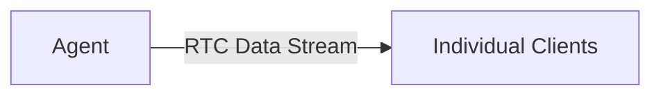
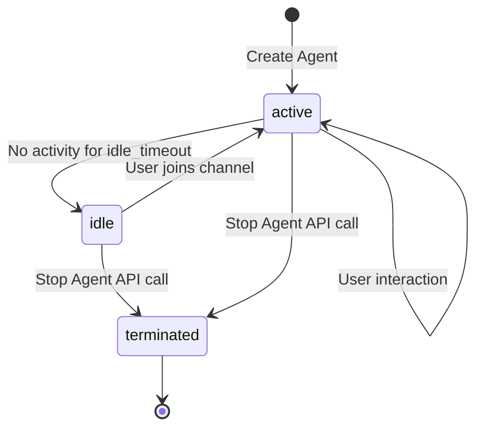
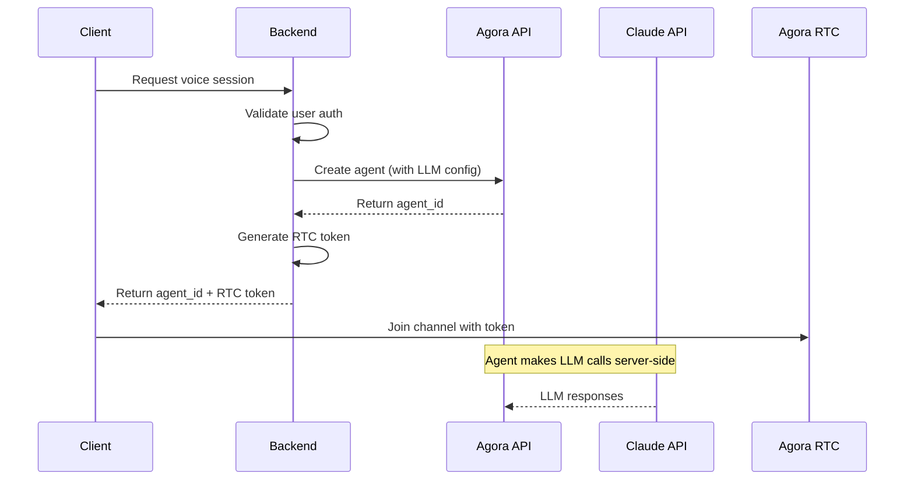

# Building Real-Time Voice AI Agents with Agora and Claude

Building a voice AI agent that feels conversational—not like a walkie-talkie—comes down to latency. The traditional pipeline is serial: capture audio → transcribe → send to LLM → synthesize speech → stream back. Each hop adds 100-300ms. By the time your agent responds, you've lost the natural rhythm of conversation.

Agora's Conversational AI Engine streamlines this pipeline. Instead of stitching together separate services for audio streaming, speech recognition, LLM calls, and TTS, the agent runs as a single real-time stream inside Agora's infrastructure. You provide an LLM endpoint (like Claude or GPT-5), configure the conversation flow, and Agora handles the audio processing automatically. The result: sub-second end-to-end latency that actually feels responsive.

This guide walks through a playground application that lets you experiment with that architecture. You'll wire up Claude as your reasoning engine, configure different conversation behaviors, and test prompt variations—all from a browser interface. No need to build the audio infrastructure from scratch; we're focusing on the parts that make your agent useful: conversation design and LLM integration.

What you'll build: a configurable voice agent that maintains context across turns, handles interruptions naturally, and integrates with Claude's extended thinking capabilities for complex reasoning tasks.


_The Convo AI Playground interface provides a complete control center for managing conversational AI agents._

## Architecture Overview

The application follows a client-server-agent pattern. Keeping the entire processing pipeline within Agora's infrastructure delivers sub-second end-to-end latency.

```mermaid
graph TB
    subgraph Browser["Browser Client"]
        MIC[Microphone] --> RTC_SDK[Agora RTC SDK]
        RTC_SDK --> RTC_CH[RTC Channel]
        RTC_CH --> RTC_SDK
        RTC_SDK --> SPEAKER[Speaker]
        RTM_SDK[RTM Client] --> RTM_CH[RTM Channel]
        RTM_CH --> RTM_SDK
    end

    subgraph Agora["Agora Infrastructure"]
        RTC_CH --> AGENT[Conversational AI Agent]
        AGENT --> RTC_CH
        AGENT --> ASR[ASR Engine]
        ASR --> LLM_PROXY[LLM Proxy]
        LLM_PROXY --> CLAUDE[Claude API]
        CLAUDE --> LLM_PROXY
        LLM_PROXY --> TTS[TTS Engine]
        TTS --> AGENT
        AGENT --> RTM_CH
    end

    style AGENT fill:#333,stroke:#f9f,stroke-width:4px
    style CLAUDE fill:#333,stroke:#bbf,stroke-width:2px
```



**Client Layer (Browser)**

The browser handles media streams via Agora's RTC SDK. Client joins an RTC channel, publishes microphone audio, and subscribes to agent audio. For transcription, the client connects to an RTM channel to receive live captions. The WebRTC stack (codec negotiation, packet loss recovery, jitter buffering) is handled by the SDK.

**Agent Layer (Agora Infrastructure)**

The Conversational AI Agent orchestrates the voice pipeline:

1. **Audio Ingestion**: Subscribes to RTC channel, receives user audio streams
2. **Speech Recognition**: Processes audio through ASR (Agora, Microsoft, or Deepgram)
3. **LLM Inference**: POSTs transcribed text + conversation context to your LLM endpoint
4. **Speech Synthesis**: Converts LLM text response to audio via TTS
5. **Audio Streaming**: Publishes synthesized speech back to RTC channel

The agent maintains a configurable message history buffer (default: 32 messages) and includes full conversation context with every LLM request. Session management and context windowing are handled at the infrastructure level.

**LLM Layer (External API)**

Claude (or any HTTP-accessible LLM) sits outside Agora's infrastructure. The agent makes standard HTTPS API calls, sending conversation context and receiving text responses. This decoupling lets you swap LLM providers, implement custom middleware, or inject dynamic context without reconfiguring the audio pipeline.

### Key Components

I've structured the playground as a set of focused modules. Each one does exactly one thing, which makes debugging and adding new features much easier.

```
convo_ai/
├── src/js/
│   ├── api.js                    # Agora REST API client
│   ├── utils.js                  # Configuration builders
│   ├── conversational-ai-api.js  # RTM transcription handler
│   ├── audio.js                  # Audio visualization
│   ├── subtitles.js              # Live captions
│   └── ui.js                     # UI orchestration
└── index.html                    # Main interface
```

**`api.js`** - The REST API Layer

This module is your interface to Agora's Conversational AI APIs. Every interaction with the agent lifecycle goes through here:

```javascript
// Core agent lifecycle
await api.createAgent(customerId, customerSecret, agentConfig);
await api.updateAgent(customerId, customerSecret, agentId, updatePayload);
await api.stopAgent(customerId, customerSecret, agentId);

// Monitoring and control
await api.queryAgent(customerId, customerSecret, agentId);
await api.listAgents(customerId, customerSecret);
await api.broadcastMessage(
  customerId,
  customerSecret,
  agentId,
  text,
  priority,
  interruptable
);
await api.interruptAgent(customerId, customerSecret, agentId);
```

Why separate these into a dedicated module? Two reasons. First, authentication happens at the API boundary—every request needs proper credentials and encoding. Second, error handling for network operations differs from UI logic. Keeping them separate makes both testable.

**`utils.js`** - Configuration Management

Here's a problem I ran into early: the agent configuration object has nested structures several levels deep. ASR config lives under `properties.asr`, TTS config under `properties.tts`, LLM config under `properties.llm`, and advanced features under `properties.advanced_features`. If you hand-write this JSON every time, you _will_ make mistakes. I did, repeatedly.

So I built `utils.js` to handle the transformation from form inputs to valid agent configuration:

```javascript
// Extract form data
const formData = Utils.getFormData();

// Validate required fields
Utils.validateFormData(formData);

// Build ASR configuration
const asrConfig = Utils.buildAsrConfig(formData);

// Build complete agent configuration
const customParams = Utils.getCustomParams();
const agentConfig = Utils.buildAgentConfig(formData, customParams);
```

The builder pattern here does three things. First, it validates required fields upfront—no point sending an API request if you're missing your LLM API key. Second, it handles type conversions (form inputs are strings, but the API expects numbers for things like `idle_timeout`). Third, it provides defaults for optional fields so you're not constantly checking "did the user specify a temperature, or should I use 1.0?"

This matters more than you might think. Agora's API is flexible, which means there are many ways to misconfigure it. Centralizing configuration logic gives you one place to encode the rules: "If RTM mode is enabled, you must set `data_channel` to 'rtm' and enable transcript in parameters." Without this, you'd be debugging malformed requests that silently fail.

**`conversational-ai-api.js`** - Real-Time Transcription

Transcription turns out to be more nuanced than "just show what the agent says." When you enable RTM transcription, the agent publishes multiple message types: temporary transcriptions (what ASR thinks you're saying mid-utterance), final transcriptions (confirmed text after you finish speaking), agent state changes (listening, thinking, speaking), and error notifications.

The `conversational-ai-api.js` module wraps Agora's RTM SDK to handle this complexity:

```javascript
// Initialize the API with RTM and RTC engines
ConversationalAIAPI.init({
  rtcEngine: agoraRTCClient,
  rtmEngine: agoraRTMClient,
  renderMode: 'text',
  enableLog: true,
  expectedAgentId: 'my-agent',
});

// Subscribe to transcription updates
const api = ConversationalAIAPI.getInstance();
api.on(EConversationalAIAPIEvents.TRANSCRIPTION_UPDATED, (chatHistory) => {
  // Handle transcription updates
  chatHistory.forEach((message) => {
    console.log(`${message.data.speaker}: ${message.data.text}`);
  });
});

// Subscribe to channel messages
await api.subscribeMessage(channelName);
```

Under the hood, the `CovSubRenderController` is doing deduplication work. Here's why that matters: ASR engines send incremental updates. You might get "Hello", then "Hello how", then "Hello how are", then finally "Hello how are you" as the user speaks. Without deduplication, your UI would show four separate messages instead of one updating line.

The controller tracks message IDs and render timestamps to distinguish temporary from final transcriptions. When a final transcription arrives, it replaces all temporary ones with the same base ID. This gives users the illusion of smooth, real-time captions without the chaos of rapidly updating text fragments.

There's also state management happening here. The agent transitions between listening (waiting for user speech), thinking (LLM is processing), and speaking (TTS is playing). These state changes get published to RTM as well, which lets you build UI feedback—maybe a thinking spinner or a visual indicator that the agent is speaking.

**`audio.js`** - Audio Visualization

You need visual feedback in voice interfaces. Without it, users don't know if the agent is speaking, if their microphone is working, or if the system is frozen. The `MediaProcessor` class handles both RTC connection management and real-time audio visualization:

  
_Real-time waveform and volume ring visualization provides immediate feedback on agent voice activity._

```javascript
const processor = new MediaProcessor();

// Join channel with audio
await processor.joinChannel(
  appId,
  channelName,
  token,
  uid,
  subtitleManager,
  agentId
);

// Audio visualization runs automatically using Web Audio API
// Creates frequency analysis and waveform display
```

The visualization works by tapping into the Web Audio API's AnalyserNode. As audio streams through the RTC connection, the analyzer performs FFT (Fast Fourier Transform) on the audio buffer, giving you frequency domain data. We then map that frequency data to visual bars—higher frequencies create taller bars, giving users an intuitive sense of audio activity.

Why this matters: in testing, I found users were uncertain when to speak without visual feedback. They'd interrupt the agent mid-sentence or sit in awkward silence waiting for a response that had already started. The waveform solves this—when it's animating, the agent is speaking. When it's flat, the floor is yours.

There's also a practical debugging benefit. When audio isn't working, the waveform immediately tells you if the problem is on the capture side (your mic) or playback side (agent audio). Flat waveform while you're speaking? Mic permission issue. Flat waveform when agent should respond? Check your RTC subscription.

**`subtitles.js`** - Live Caption System

Transcription is one of those features that seems simple until you implement it. The `SubtitleManager` handles two distinct architectures, each with different tradeoffs:

**RTM Mode** requires RTM signaling enabled on your Agora AppID. This gives you pub/sub messaging with guaranteed delivery, message receipts, and the ability to broadcast messages to all participants. When the agent transcribes speech, it publishes to an RTM channel that all clients subscribe to. You get bidirectional transcription (both user and agent speech), status updates, and the ability to inject context via broadcast messages.

```mermaid
graph LR
    A1[Agent] -->|Publishes| B1[RTM Channel]
    B1 -->|Delivers| C1[All Clients]
    C1 -->|Receipt Ack| B1

    style B1 fill:#333,stroke:#afa,stroke-width:2px
```



**Data Stream Mode** uses RTC data streams—essentially, data packets piggy-backed onto the RTC connection. Simpler setup (no RTM configuration), but you only get agent transcription, and there's no broadcast capability. This works fine for single-user scenarios but doesn't scale to multi-party conversations.



Both modes face the same deduplication challenge I mentioned earlier. ASR engines send incremental updates, and you need logic to coalesce them into coherent sentences. The `SubtitleManager` maintains a message history buffer, tracks message IDs, and replaces temporary transcriptions with final ones. It also handles the chat history UI—scrolling, speaker labels, timestamps—so you're not reinventing that wheel.

## Setting Up Claude as Your LLM

The LLM is where your agent's personality and intelligence live. I've used Claude (via Anthropic's API) for this implementation because of its balance between response quality and latency, but the architecture supports any LLM that accepts HTTP requests.

### Step 1: Get Your Anthropic API Key

1. Create an account at [Anthropic Console](https://console.anthropic.com/)
2. Navigate to API Keys section
3. Generate a new API key
4. Keep it secure—you'll need it for the LLM configuration

Standard API onboarding. The key point: don't commit this to version control. In the playground, I'm storing it in localStorage for convenience, but production apps should proxy LLM calls through your backend.

### Step 2: Configure the LLM Endpoint

In the application's LLM Settings section:

**LLM URL**: `https://api.anthropic.com/v1/messages`

**API Key**: Your Anthropic API key

**Model**: Choose your Claude model based on your latency and quality requirements:

- `claude-3-5-sonnet-20241022` (Recommended - Best balance of intelligence and speed)
- `claude-3-5-haiku-20241022` (Fastest - Great for simple conversations)
- `claude-3-opus-20240229` (Highest intelligence - Best for complex tasks)

Why choose Sonnet? For voice conversations, you need fast responses without sacrificing quality. Sonnet delivers responses in ~2-3 seconds while maintaining strong reasoning capabilities. Opus is too slow for natural conversation flow, while Haiku sometimes lacks nuance in complex scenarios.

### Step 3: Configure System Messages

The system message defines your agent's personality and capabilities:

```
You are a helpful AI voice assistant. Keep responses concise since they will be spoken aloud.
Avoid lengthy explanations unless specifically asked. Use natural conversational language.
```

This matters more than you might expect. Claude's default behavior is optimized for written communication—detailed, thorough, often lengthy. That works great in text chat where users can skim. In voice, verbosity kills the experience. Users can't skim audio. They have to listen to every word.

I spent considerable time tuning this. Early iterations had Claude giving comprehensive, well-structured answers that sounded robotic when spoken. "To answer your question, I'll first explain the background context, then provide three key points, and finally offer a conclusion." Nobody talks like that. The system message needs to explicitly instruct: be conversational, be brief, sound human.

A few rules I've found effective:

1. **Set response length expectations**: "Keep responses under 50 words unless asked for details"
2. **Define personality explicitly**: "You're friendly but professional" vs. "You're casual and playful"
3. **Handle edge cases**: "If you don't know something, say so directly instead of hedging"
4. **Format guidance**: "Avoid lists and bullet points—speak in natural sentences"

**Greeting Message**: What the agent says when the first user joins the channel.

```
Hello! I'm your AI assistant. How can I help you today?
```

This fires automatically on channel join. Keep it short and inviting. Users are already dealing with the cognitive load of starting a voice conversation—don't overwhelm them with a lengthy introduction.

**Failure Message**: What the agent says when encountering errors (LLM timeout, API errors, invalid responses).

```
I'm sorry, I'm having trouble processing that right now. Could you try again?
```

You want this message to be apologetic but not alarming. "Something went wrong with my language model endpoint" is technically accurate but creates user anxiety. "I'm having trouble" is softer and more human.

### Step 4: Configure Custom Parameters

Claude's API requires parameters that Agora's standard LLM configuration doesn't expose by default. Add these via the Custom Parameters section:

**Parameter 1 (Required):**

- Type: `number`
- Key: `max_tokens`
- Value: `1024`

Claude requires `max_tokens` to limit response length. 1024 tokens (~800 words) balances detailed responses against voice conversation constraints. Lower values (512) improve response time but truncate complex answers. Higher values (2048+) increase latency and API costs.

**Parameter 2 (Optional but Recommended):**

- Type: `number`
- Key: `temperature`
- Value: `1.0`

Controls response randomness. `1.0` (default) provides natural variety. Lower values (0.7) produce more deterministic, focused responses but can feel repetitive. Higher values (1.2+) increase creativity at the cost of coherence and factual accuracy.

**Parameter 3 (Advanced):**

- Type: `array`
- Key: `stop_sequences`
- Value: `["Human:", "Assistant:"]`

Instructs Claude to stop generation at specific strings. Useful for implementing structured conversation patterns or preventing the model from simulating multi-turn exchanges in a single response.

### Understanding Claude's Request Format

Agora constructs and sends requests to your LLM endpoint in the chosen format. Four our example wer're using Anthropic's Messages API format:

```json
{
  "model": "claude-3-5-sonnet-20241022",
  "max_tokens": 1024,
  "temperature": 1.0,
  "system": "You are a helpful AI voice assistant...",
  "messages": [
    { "role": "user", "content": "What's the weather like today?" },
    {
      "role": "assistant",
      "content": "I don't have access to real-time weather data."
    },
    { "role": "user", "content": "Can you tell me a joke instead?" }
  ]
}
```

The agent maintains conversation context automatically by appending to the `messages` array. The `max_history` parameter (default: 32 messages) controls buffer size. Each message consumes context window tokens—32 messages typically represents 5-10 conversation turns while leaving headroom for system messages and response generation.

**Context Window Management:**

Claude 3.5 Sonnet has a 200K token context window, but practical limits are lower. Consider:

- System message: ~100-500 tokens
- Conversation history (32 messages): ~2,000-8,000 tokens depending on verbosity
- Response generation: 1,024 tokens (as configured)
- Working buffer: ~10-20% overhead for formatting

For most voice applications, 32 message history is sufficient. Reduce to 16 for short Q&A interactions. Increase to 64+ for complex, context-dependent conversations (technical support, tutoring).

## Complete Configuration Example

Here's a working configuration for a Claude-powered agent:

  
_The agent configuration form allows you to set up all aspects of your conversational AI agent, from LLM settings to TTS voice selection._

**Agent Settings:**

- Unique Name: `claude-assistant-001`
- Channel Name: `my-voice-channel`
- Agent RTC UID: `8888` (arbitrary but should be consistent)
- Remote RTC UIDs: `*` (allows any user to talk to the agent)
- Idle Timeout: `300` (agent stops after 5 minutes of inactivity)

**LLM Configuration:**

- Provider: Anthropic (via API)
- URL: `https://api.anthropic.com/v1/messages`
- API Key: `sk-ant-api03-...` (your actual key)
- Model: `claude-3-5-sonnet-20241022`
- System Message:
  ```
  You are Emma, a friendly AI assistant who helps users with their questions.
  Speak naturally and conversationally. Keep responses under 50 words unless
  the user asks for detailed explanations.
  ```
- Greeting: `Hi, I'm Emma! What can I help you with?`
- Max History: `32`

**Custom Parameters:**

```json
{
  "max_tokens": 1024,
  "temperature": 1.0
}
```

**TTS Configuration:**

Agora supports multiple TTS vendors, each with different characteristics:

**Microsoft Azure TTS**:

- Vendor: `microsoft`
- Region: `eastus` (or closest to your users)
- Voice: `en-US-AriaNeural`
- Rate: `1.0` (normal speed)
- Volume: `80`
- Characteristics: High-quality neural voices, wide language support, reliable performance

**ElevenLabs TTS**:

- Vendor: `elevenlabs`
- API Key: Required
- Model: `eleven_multilingual_v2` or `eleven_turbo_v2`
- Voice ID: Specific voice identifier
- Characteristics: Most natural-sounding speech, customizable voices, higher cost

**Cartesia TTS**:

- Vendor: `cartesia`
- API Key: Required
- Model: `sonic-2`
- Voice: Object with `mode: "id"` and `id: "<voice_id>"`
- Characteristics: Ultra-low latency, real-time streaming, excellent for conversational agents

**OpenAI TTS**:

- Vendor: `openai`
- API Key: Required
- Voice: `alloy`, `echo`, `fable`, `onyx`, `nova`, `shimmer`
- Characteristics: High-quality neural synthesis, multiple voice options, OpenAI ecosystem integration

**Hume AI TTS**:

- Vendor: `hume_ai`
- API Key: Required
- Model: `gpt-4o-mini-tts`
- Voice: `coral`
- Speed: `0.25-4.0` (configurable)
- Characteristics: Customizable speaking rate, emotional tone control, trailing silence management

For this example, we'll use Microsoft Azure TTS for its reliability and quality.

**ASR Configuration:**

Agora supports multiple ASR vendors:

**Agora ASR (ares)**:

- Vendor: `ares`
- Language: `en-US`
- Characteristics: Built-in, no additional API keys, good for testing, limited accuracy with accents

**Microsoft ASR**:

- Vendor: `microsoft`
- API Key: Required
- Region: e.g., `eastus`
- Language: `en-US` (extensive language support)
- Characteristics: High accuracy, robust noise handling, accent-adaptive

**Deepgram ASR**:

- Vendor: `deepgram`
- API Key: Required
- URL: `wss://api.deepgram.com/v1/listen`
- Model: `nova-2` (most accurate) or `nova` (faster)
- Language: `en`
- Characteristics: Lowest latency (50-150ms), excellent accuracy, real-time streaming

For production, consider Microsoft ASR or Deepgram for higher accuracy, especially in noisy environments. Agora ASR works well for testing but has limitations with accents and background noise.

## Advanced Configuration

### Voice Activity Detection (VAD)

VAD determines turn-taking behavior—when the system considers user speech complete and triggers agent response. This directly impacts conversation naturalness and latency.

**Agora VAD (Default):**

```javascript
{
  type: "agora_vad",
  interrupt_mode: "interrupt",
  interrupt_duration_ms: 160,
  silence_duration_ms: 640,
  threshold: 0.5
}
```

**Configuration Parameters:**

- `interrupt_duration_ms`: Minimum duration of user speech to interrupt agent output. 160ms provides immediate interruption without triggering on background noise. Increase to 300-500ms in noisy environments.
- `silence_duration_ms`: Duration of silence before speech is considered complete. 640ms prevents premature cutoff during natural pauses (thinking, breathing). Decrease to 400ms for rapid-fire Q&A, increase to 800ms+ for thoughtful conversations.
- `threshold`: Audio level sensitivity (0.0-1.0). 0.5 works in typical environments. Lower values (0.3) increase sensitivity to quiet speech but trigger more false positives. Higher values (0.7) reduce false triggers but may miss soft-spoken users.

Agora VAD operates client-side with ~10-20ms latency. It uses energy-based detection combined with zero-crossing rate analysis—fast but purely acoustic. Can't distinguish intentional pauses from speech completion.

**Server VAD (Semantic Detection):**

```javascript
{
  type: "server_vad",
  interrupt_mode: "interrupt",
  create_response: true,
  interrupt_response: true
}
```

Available only with multimodal LLM providers (OpenAI Realtime API). Server VAD analyzes speech semantically—distinguishes "umm..." (still thinking) from genuine turn completion. Higher latency (~100-200ms additional) but more accurate turn-taking. Use for complex, multi-clause conversations where acoustic VAD prematurely triggers.

### Interruption Behavior

Controls agent response when user speaks during agent output:

**Interrupt Mode Options:**

```javascript
interrupt_mode: 'interrupt' | 'append' | 'ignore';
```

- **`interrupt`**: Immediately stops agent speech, discards remaining output, processes new user input. Lowest latency, most natural for conversational Q&A. Agent must regenerate if interrupted mid-response.

- **`append`**: Completes current agent response, queues new user input for processing afterward. Prevents fragmentary responses in storytelling or instruction sequences. User waits longer for acknowledgment.

- **`ignore`**: Blocks interruptions until agent finishes speaking. Use sparingly—violates conversational norms. Appropriate for critical information (emergency instructions, legal disclaimers) or single-direction content (meditation scripts).

**Implementation Note:** Interrupt mode operates at the TTS level. When interrupted, the agent must reinvoke the LLM with updated context. This adds ~2-3 seconds of latency. For latency-sensitive applications, consider streaming TTS with chunked LLM responses to reduce interruption recovery time.

### Silence Management

Handles scenarios where users stop responding:

```javascript
{
  silence_config: {
    timeout_ms: 10000,
    action: "speak",
    content: "Are you still there? Let me know if you need anything."
  }
}
```

Triggers after `timeout_ms` of no user speech. Prevents dead air and clarifies whether the user expects agent response or has left the conversation.

**Recommended Timeouts by Use Case:**

| Use Case                  | Timeout | Rationale                                                            |
| ------------------------- | ------- | -------------------------------------------------------------------- |
| Q&A / Customer Support    | 8-10s   | Users typically respond quickly or are formulating complex questions |
| Technical Troubleshooting | 15-20s  | Users need time to check systems, read screens                       |
| Educational / Tutoring    | 10-15s  | Students may be processing information or working through problems   |
| Meditation / Wellness     | 30-60s  | Intentional silence is part of the experience                        |
| Voice Commerce            | 5-8s    | Friction kills conversion; prompt quickly                            |

Set `action` to `"speak"` for verbal prompt or `"disconnect"` to terminate session. The `content` field defines the spoken message.

### Input/Output Modalities

Defines what data types the agent can process and generate:

```javascript
{
  input_modalities: ["text", "audio"],
  output_modalities: ["text", "audio"]
}
```

**Standard Voice Configuration (text + audio):**

- Input: User speech → ASR → text transcription
- Output: LLM text response → TTS → audio playback

**Multimodal Configuration (text + audio + image):**

```javascript
{
  input_modalities: ["text", "audio", "image"],
  output_modalities: ["text", "audio"]
}
```

Requires multimodal LLM (GPT-4 Vision, Claude 3). Enables camera integration where the agent analyzes visual input alongside speech. The system captures video frames at configurable intervals (default: 1 frame/second) and includes them in LLM context.

**Use Cases:**

| Scenario          | Input                        | Why Multimodal                                                        |
| ----------------- | ---------------------------- | --------------------------------------------------------------------- |
| Technical Support | User shows error screen      | Agent provides context-specific troubleshooting based on visual state |
| Accessibility     | User points camera at object | Agent describes visual environment for visually impaired users        |
| Education         | Student shows math problem   | Agent provides step-by-step guidance based on written work            |
| Retail            | Customer shows product       | Agent identifies item and provides information/recommendations        |

**Performance Implications:**

- Image encoding adds ~50-100ms latency per frame
- Each image consumes significant context tokens (typically 765-1700 tokens depending on resolution)
- LLM inference time increases by ~30-50% with image input
- Network bandwidth: ~50-200KB per frame depending on compression

For most voice-only applications, stick with text+audio. Only add image modality when visual context is essential to the use case.

## Real-Time Transcription Setup

Transcription serves two purposes: user-facing captions and developer debugging. Both modes provide real-time text output of agent and user speech, but differ in transport mechanism and feature set.

### RTM Mode (Pub/Sub Messaging)

Uses Agora's Real-Time Messaging SDK for reliable, ordered delivery of transcription events.

**Requirements:**

1. RTM signaling enabled on your Agora App ID (requires Agora Console configuration)
2. RTM-compatible authentication token (combined RTC+RTM token)
3. Client UID configured in agent properties

**Configuration:**

```javascript
{
  advanced_features: {
    enable_rtm: true
  },
  parameters: {
    data_channel: "rtm",
    transcript: {
      enable: true,
      protocol_version: "v2"
    },
    enable_metrics: true,
    enable_error_message: true
  }
}
```

**Capabilities:**

- **Bidirectional transcription**: Captures both user and agent speech with speaker labels
- **Message receipts**: Acknowledgment system for guaranteed delivery
- **Broadcast API**: Inject external context into conversation via `broadcastMessage()` API
- **Agent state events**: Real-time notifications when agent transitions between listening/thinking/speaking states
- **Error notifications**: Transport-level errors surfaced via RTM channel

**Message Format:**

```json
{
  "type": "transcription",
  "message_id": "msg_001",
  "speaker": "user",
  "text": "What's the weather today?",
  "is_final": true,
  "timestamp": 1698765432000
}
```

RTM delivers messages via pub/sub—all channel subscribers receive transcriptions. Latency: ~50-100ms from speech completion to client delivery.

### Data Stream Mode (RTC Data Channel)

Uses RTC data streams (SCTP) to piggyback transcription on audio connection.

**Requirements:**

1. RTC connection only (no additional infrastructure)
2. Transcript enabled in parameters

**Configuration:**

```javascript
{
  parameters: {
    transcript: {
      enable: true,
      protocol_version: "v2"
    }
  }
}
```

**Capabilities:**

- **Agent transcription only**: No user speech transcription
- **Simpler setup**: No RTM credentials or channel management
- **Direct delivery**: Point-to-point, no pub/sub overhead

**Limitations:**

- No broadcast message support
- No message receipts or delivery guarantees
- No agent state events
- Higher packet loss susceptibility (uses unreliable data channel mode)

**When to Use Each:**

| Requirement                     | RTM Mode | Data Stream |
| ------------------------------- | -------- | ----------- |
| Production conversation logging | ✓        | ✗           |
| Multi-client scenarios          | ✓        | ✗           |
| Broadcast dynamic context       | ✓        | ✗           |
| Rapid prototyping               | ✗        | ✓           |
| Minimal infrastructure          | ✗        | ✓           |
| User speech transcription       | ✓        | ✗           |

For production applications, RTM mode is recommended. Data Stream mode works for quick testing or single-user demos where transcription reliability isn't critical.

## Building Agent Configurations Programmatically

The playground UI is useful for experimentation, but production systems require programmatic agent management. This section demonstrates how to construct agent configurations via code and the Agora Conversational AI REST API.

  
_Creating an agent using the `/join` endpoint - the POST request structure as seen in browser DevTools._

```javascript
// Build ASR configuration
const asrConfig = {
  vendor: 'ares',
  language: 'en-US',
};

// Build TTS configuration
const ttsConfig = {
  vendor: 'microsoft',
  params: {
    key: process.env.AZURE_SPEECH_KEY,
    region: 'eastus',
    voice_name: 'en-US-AriaNeural',
    rate: 1.0,
    volume: 80,
  },
};

// Build LLM configuration
const llmConfig = {
  url: 'https://api.anthropic.com/v1/messages',
  api_key: process.env.ANTHROPIC_API_KEY,
  system_messages: [
    {
      role: 'system',
      content: 'You are a helpful AI assistant. Keep responses concise.',
    },
  ],
  greeting_message: 'Hi! How can I help you?',
  failure_message: 'Sorry, I encountered an error. Please try again.',
  max_history: 32,
  input_modalities: ['text', 'audio'],
  output_modalities: ['text', 'audio'],
  params: {
    model: 'claude-3-5-sonnet-20241022',
    max_tokens: 1024,
    temperature: 1.0,
  },
};

// Build turn detection
const turnDetection = {
  type: 'agora_vad',
  interrupt_mode: 'interrupt',
  interrupt_duration_ms: 160,
  silence_duration_ms: 640,
  threshold: 0.5,
};

// Build complete agent configuration
const agentConfig = {
  name: 'claude-assistant-001',
  properties: {
    channel: 'my-voice-channel',
    token: process.env.AGORA_RTC_TOKEN,
    agent_rtc_uid: '8888',
    remote_rtc_uids: ['*'],
    enable_string_uid: false,
    idle_timeout: 300,
    asr: asrConfig,
    tts: ttsConfig,
    llm: llmConfig,
    turn_detection: turnDetection,
    advanced_features: {
      enable_rtm: true,
    },
    parameters: {
      data_channel: 'rtm',
      transcript: {
        enable: true,
        protocol_version: 'v2',
      },
    },
  },
};

// Create the agent via REST API
const response = await fetch(
  `https://api.agora.io/api/conversational-ai-agent/v2/projects/${APP_ID}/join`,
  {
    method: 'POST',
    headers: {
      'Content-Type': 'application/json',
      Authorization: `Basic ${btoa(`${CUSTOMER_ID}:${CUSTOMER_SECRET}`)}`,
    },
    body: JSON.stringify(agentConfig),
  }
);

const result = await response.json();

if (response.ok) {
  console.log('Agent created successfully');
  console.log('Agent ID:', result.agent_id);
  console.log('Channel:', result.channel);

  // Store agent ID for lifecycle management
  const agentId = result.agent_id;

  // Query agent status
  const statusResponse = await fetch(
    `https://api.agora.io/api/conversational-ai-agent/v2/projects/${APP_ID}/agents/${agentId}`,
    {
      headers: {
        Authorization: `Basic ${btoa(`${CUSTOMER_ID}:${CUSTOMER_SECRET}`)}`,
      },
    }
  );
  const status = await statusResponse.json();
  console.log('Agent status:', status.state); // "active", "idle", or "terminated"
} else {
  console.error('Agent creation failed:', result);
  // Handle specific error cases
  if (response.status === 401) {
    console.error('Authentication failed: Check Customer ID and Secret');
  } else if (response.status === 400) {
    console.error('Invalid configuration:', result.message);
  }
}
```

### Agent Lifecycle Management

Agents exist in three states:



- **Active**: Agent is processing audio, transcribing, or generating responses. Consumes full resources.

- **Idle**: No users in channel for `idle_timeout` duration (default: 300s). Agent remains in memory but consumes minimal resources. Automatically transitions back to active when user rejoins.

- **Terminated**: Agent stopped via API or error condition. All resources released. Cannot be reactivated—must create new agent.

### Dynamic Configuration Updates

Update agent configuration without recreating:

  
_Updating or stopping an agent session through REST API calls - PATCH and DELETE operations in DevTools._

```javascript
// Update LLM parameters mid-conversation
await fetch(
  `https://api.agora.io/api/conversational-ai-agent/v2/projects/${APP_ID}/agents/${agentId}`,
  {
    method: 'PATCH',
    headers: {
      'Content-Type': 'application/json',
      Authorization: `Basic ${btoa(`${CUSTOMER_ID}:${CUSTOMER_SECRET}`)}`,
    },
    body: JSON.stringify({
      properties: {
        llm: {
          system_messages: [
            {
              role: 'system',
              content:
                'You are now in expert technical support mode. Provide detailed troubleshooting steps.',
            },
          ],
          params: {
            temperature: 0.7, // Lower temperature for more focused responses
          },
        },
      },
    }),
  }
);
```

Use PATCH updates to adapt agent behavior based on conversation state, user preferences, or A/B testing scenarios. Changes take effect on next LLM invocation.

### Broadcast Messages (Dynamic Context Injection)

Inject external context into active conversations:

```javascript
// Send context about user's account status
await fetch(
  `https://api.agora.io/api/conversational-ai-agent/v2/projects/${APP_ID}/agents/${agentId}/broadcast`,
  {
    method: 'POST',
    headers: {
      'Content-Type': 'application/json',
      Authorization: `Basic ${btoa(`${CUSTOMER_ID}:${CUSTOMER_SECRET}`)}`,
    },
    body: JSON.stringify({
      text: '[System Context: User account tier is Premium, subscription expires in 30 days]',
      priority: 'high', // or 'normal'
      interruptable: false, // Whether user can interrupt this message
    }),
  }
);
```

Broadcast messages appear in conversation context as system messages. Use cases:

- Inject real-time data (stock prices, weather, inventory levels)
- Provide user-specific context (account status, purchase history)
- Send notifications (new message arrived, appointment reminder)
- Implement human handoff (agent transfers to human operator with full context)

**Priority Handling:**

- `high`: Agent speaks message immediately, interrupting current output if necessary
- `normal`: Agent queues message after completing current response

## Testing Your Configuration

### Quick Test Flow

1. **Set Credentials**: Click "Set API Credentials" and enter your Agora Customer ID, Secret, and App ID

2. **Configure Agent**: Fill in agent settings (channel, UID, etc.)

3. **Configure Claude**: Set up LLM section with Anthropic API details

4. **Configure Voice**: Choose TTS vendor and voice

5. **Create Agent**: Click "Create Agent" button

6. **Join Channel**: Click "Join Channel" button to start voice chat

7. **Test Conversation**: Speak naturally and verify the agent responds appropriately

### Debugging Common Issues

**Agent Not Responding:**

Symptoms: User speaks but agent remains silent. Transcription may or may not appear.

Diagnostic steps:

1. Check browser console for JavaScript errors
2. Verify Claude API key validity (test with `curl` against Anthropic's API)
3. Confirm `max_tokens` parameter exists in custom params
4. Inspect network tab—look for 401/403 responses to LLM endpoint
5. Check microphone permissions in browser settings
6. Verify agent state transitions (should show "listening" → "thinking" → "speaking")

Common causes:

- Invalid or expired API key (403)
- Missing `max_tokens` parameter (Claude returns 400)
- CORS issues with LLM endpoint (browser blocks request)
- Microphone access denied (browser console shows warning)

**Slow Response Time:**

Symptoms: Noticeable delay (>5 seconds) between user speech and agent response.

Latency breakdown:

```
User speech end-of-utterance detection: ~640ms (VAD silence_duration_ms)
ASR transcription: ~200-500ms
Network round-trip to LLM: ~100-300ms
LLM inference: ~2-5s (model-dependent)
TTS synthesis: ~300-700ms
Audio playback buffering: ~100-200ms
---
Total: 3.5-7.6 seconds typical
```

Optimization strategies:

1. **Reduce LLM latency**: Switch from Opus → Sonnet (saves ~2-3s) or Sonnet → Haiku (saves ~1-2s)
2. **Shrink context window**: Reduce `max_history` from 32 to 16 (saves ~10-20% LLM time)
3. **Decrease VAD silence threshold**: Lower `silence_duration_ms` from 640ms to 400ms (saves ~240ms but may cause premature cutoff)
4. **Optimize TTS**: Switch to faster TTS provider or reduce audio quality
5. **Check network path**: Use `traceroute` to measure latency to Anthropic API (should be <100ms)

**Agent Cuts Off Mid-Sentence:**

Symptoms: Agent speech abruptly stops when user makes noise or speaks.

This is usually VAD false triggering. Causes:

- `interrupt_duration_ms` too low (160ms default may trigger on background noise)
- VAD `threshold` too sensitive (0.5 default may pick up ambient sound)
- Keyboard typing, paper rustling, or room echo being interpreted as speech

Solutions:

1. Increase `interrupt_duration_ms` from 160ms to 300-500ms
2. Increase VAD `threshold` from 0.5 to 0.6-0.7
3. Use push-to-talk UI pattern to gate audio input
4. Implement noise suppression via Web Audio API before feeding to RTC SDK

**Transcription Not Showing:**

Symptoms: Audio conversation works but no text captions appear.

RTM Mode troubleshooting:

1. Verify RTM enabled on App ID (Agora Console → Project → Features → RTM toggle)
2. Confirm RTM token scope includes both RTC and RTM privileges
3. Check `data_channel: "rtm"` in agent configuration
4. Inspect browser console for RTM connection errors (common: token expiration, UID mismatch)
5. Verify `transcript.enable: true` in parameters
6. Check RTM channel name matches convention (typically same as RTC channel)

Data Stream Mode troubleshooting:

1. Confirm `transcript.enable: true` in parameters
2. Check RTC data stream listener is registered before agent starts speaking
3. Verify no firewall blocking UDP (data streams use same ports as RTC audio)

**Poor Speech Recognition:**

- Consider upgrading from Microsoft or Deepgram to Agora ASR to improve accuracy
- Adjust VAD threshold (lower for quiet environments)
- Check microphone quality and positioning

## Production Considerations

### API Key Management

The playground stores credentials in `localStorage` for rapid prototyping. Production deployments must secure credentials server-side.

**Secure Architecture Pattern:**



**Implementation Guidelines:**

1. **Never expose in client code**:

   - Agora Customer ID/Secret
   - Claude/LLM API keys
   - App Certificate

2. **Backend agent creation endpoint**:

```javascript
// Express.js example
app.post('/api/voice-session', authenticateUser, async (req, res) => {
  const { userId, channelName } = req.body;

  // Build agent config server-side
  const agentConfig = {
    name: `agent-${userId}-${Date.now()}`,
    properties: {
      channel: channelName,
      agent_rtc_uid: generateAgentUid(),
      llm: {
        url: process.env.ANTHROPIC_API_URL,
        api_key: process.env.ANTHROPIC_API_KEY,
        // ... rest of config
      },
    },
  };

  // Create agent via Agora API
  const agent = await createAgoraAgent(agentConfig);

  // Generate short-lived RTC token
  const token = RtcTokenBuilder.buildTokenWithUid(
    process.env.AGORA_APP_ID,
    process.env.AGORA_APP_CERTIFICATE,
    channelName,
    userId,
    RtcRole.PUBLISHER,
    Math.floor(Date.now() / 1000) + 3600 // 1 hour expiry
  );

  res.json({
    agentId: agent.agent_id,
    channelName: channelName,
    token: token,
    uid: userId,
  });
});
```

3. **Client receives only non-sensitive data**: Agent ID, RTC token, channel name. Client cannot access LLM credentials or create arbitrary agents.

### Token Generation

RTC tokens provide time-limited channel access with specified privileges.

**Token Structure:**

```javascript
const token = RtcTokenBuilder.buildTokenWithUid(
  appId, // Agora App ID (public)
  appCertificate, // Secret, never expose to client
  channelName, // Channel this token grants access to
  uid, // User ID (0 for wildcard, or specific UID)
  role, // RtcRole.PUBLISHER or RtcRole.SUBSCRIBER
  privilegeExpireTime // Unix timestamp (current time + duration)
);
```

**Role Selection:**

- `PUBLISHER`: User needs to publish audio (typical for voice interaction)
- `SUBSCRIBER`: User only listens (monitoring, recording, analytics) |

**Combined RTC+RTM Tokens:**

If using RTM transcription, generate tokens that cover both services:

```javascript
// Build RTC privileges
const rtcPrivilege = {
  [RtcTokenBuilder.kJoinChannel]: privilegeExpireTime,
  [RtcTokenBuilder.kPublishAudioStream]: privilegeExpireTime,
};

// Build RTM privileges
const rtmPrivilege = {
  [RtmTokenBuilder.kRtmLogin]: privilegeExpireTime,
};

// Generate combined token
const token = AccessToken.build(appId, appCertificate, channelName, uid, {
  ...rtcPrivilege,
  ...rtmPrivilege,
});
```

### Scaling Considerations

**Resource Consumption Per Agent:**

Monitor your usage:

```javascript
parameters: {
  enable_metrics: true,
  enable_error_message: true
}
```

### Error Handling

Voice AI systems have multiple failure modes. Implement graceful degradation and user-visible error states.

**Agent Creation Errors:**

```javascript
async function createAgentWithRetry(config, maxRetries = 3) {
  for (let attempt = 0; attempt < maxRetries; attempt++) {
    try {
      const response = await fetch(
        `https://api.agora.io/api/conversational-ai-agent/v2/projects/${APP_ID}/join`,
        {
          method: 'POST',
          headers: {
            'Content-Type': 'application/json',
            Authorization: `Basic ${btoa(`${CUSTOMER_ID}:${CUSTOMER_SECRET}`)}`,
          },
          body: JSON.stringify(config),
        }
      );

      const result = await response.json();

      if (response.ok) {
        return result;
      }

      // Handle specific error cases
      switch (response.status) {
        case 400:
          // Invalid configuration - don't retry
          throw new Error(`Configuration error: ${result.message}`);

        case 401:
          // Auth failure - don't retry
          throw new Error('Authentication failed: Invalid credentials');

        case 429:
          // Rate limited - retry with backoff
          const retryAfter =
            response.headers.get('Retry-After') || Math.pow(2, attempt);
          await sleep(retryAfter * 1000);
          continue;

        case 503:
          // Service unavailable - retry with exponential backoff
          await sleep(Math.pow(2, attempt) * 1000);
          continue;

        default:
          throw new Error(`Unexpected error: ${response.status}`);
      }
    } catch (error) {
      if (attempt === maxRetries - 1) throw error;
      await sleep(Math.pow(2, attempt) * 1000);
    }
  }
}
```

**Runtime Error Handling:**

Monitor RTM error messages when `enable_error_message: true`:

```javascript
api.on(EConversationalAIAPIEvents.ERROR, (errorEvent) => {
  const { code, message, severity } = errorEvent;

  switch (code) {
    case 'LLM_TIMEOUT':
      // LLM didn't respond within timeout window (typically 30s)
      notifyUser('The assistant is taking longer than usual. Please wait...');
      break;

    case 'LLM_ERROR':
      // LLM returned error (API quota, invalid response format)
      playFailureMessage();
      logError('LLM failure', { message, timestamp: Date.now() });
      break;

    case 'ASR_ERROR':
      // Speech recognition failed
      notifyUser("Sorry, I couldn't understand that. Please try again.");
      break;

    case 'TTS_ERROR':
      // Speech synthesis failed
      // Send text fallback via RTM data channel
      sendTextFallback(lastAgentResponse);
      break;

    case 'NETWORK_ERROR':
      // RTC connection issues
      if (severity === 'critical') {
        showReconnectDialog();
      }
      break;
  }
});
```

**Circuit Breaker Pattern for LLM Calls:**

Prevent cascading failures when LLM is degraded:

```javascript
class LLMCircuitBreaker {
  constructor(threshold = 5, timeout = 60000) {
    this.failureCount = 0;
    this.threshold = threshold;
    this.timeout = timeout;
    this.state = 'CLOSED'; // CLOSED, OPEN, HALF_OPEN
    this.nextRetry = null;
  }

  async call(llmFunction) {
    if (this.state === 'OPEN') {
      if (Date.now() < this.nextRetry) {
        throw new Error('Circuit breaker is OPEN');
      }
      this.state = 'HALF_OPEN';
    }

    try {
      const result = await llmFunction();
      this.onSuccess();
      return result;
    } catch (error) {
      this.onFailure();
      throw error;
    }
  }

  onSuccess() {
    this.failureCount = 0;
    this.state = 'CLOSED';
  }

  onFailure() {
    this.failureCount++;
    if (this.failureCount >= this.threshold) {
      this.state = 'OPEN';
      this.nextRetry = Date.now() + this.timeout;
      // Notify operations team
      alertOps('LLM circuit breaker opened');
    }
  }
}
```

**Common Error Codes and Remediation:**

| Error Code            | HTTP Status | Cause                           | Solution                                        |
| --------------------- | ----------- | ------------------------------- | ----------------------------------------------- |
| `INVALID_PARAMETER`   | 400         | Malformed agent config          | Validate config against schema before sending   |
| `UNAUTHORIZED`        | 401         | Invalid credentials             | Rotate credentials, check encoding              |
| `INSUFFICIENT_QUOTA`  | 402         | Account quota exceeded          | Upgrade plan or implement usage caps            |
| `RATE_LIMIT_EXCEEDED` | 429         | Too many requests               | Implement exponential backoff                   |
| `CHANNEL_OCCUPIED`    | 409         | Agent already exists in channel | Use unique channel names or stop existing agent |
| `LLM_UNREACHABLE`     | 502         | Can't reach LLM endpoint        | Check LLM service status, firewall rules        |
| `SERVICE_UNAVAILABLE` | 503         | Temporary Agora outage          | Retry with backoff, check status page           |

## Use Cases and Implementation Patterns

### Customer Support Bot

**Technical Requirements:**

- Low latency (<3s response time) for natural troubleshooting flow
- Context retention across multi-step diagnostic procedures
- Ability to inject real-time data (order status, account info)
- Escalation path to human agents with full conversation context

**Configuration:**

```javascript
const supportAgentConfig = {
  properties: {
    llm: {
      system_messages: [{
        role: "system",
        content: `You are a customer support agent for TechCo.

        Your capabilities:
        - Access user account information via injected context
        - Troubleshoot technical issues step-by-step
        - Escalate to human agents when necessary

        Guidelines:
        - Ask one diagnostic question at a time
        - Confirm understanding before proceeding
        - Use simple, non-technical language unless user demonstrates technical knowledge
        - Always acknowledge user frustration empathetically

        Escalation criteria:
        - User explicitly requests human agent
        - Issue requires account-level changes you cannot perform
        - Troubleshooting exceeds 5 minutes without resolution`
      }],
      max_history: 48, // Longer context for complex troubleshooting
      params: {
        temperature: 0.7, // Lower temperature for consistent, factual responses
      }
    },
    turn_detection: {
      interrupt_mode: "interrupt", // Users need to interrupt for clarifications
      silence_duration_ms: 800, // Slightly longer—users may be performing steps
    },
    silence_config: {
      timeout_ms: 10000,
      action: "speak",
      content: "Are you still there? I'm here when you're ready to continue."
    }
  }
};

// Runtime: Inject user context via broadcast
async function startSupportSession(userId, agentId) {
  const userData = await fetchUserData(userId);

  await broadcastMessage(agentId,
    `[Context: User ${userData.name}, Account tier: ${userData.tier},
     Recent orders: ${userData.recentOrders.map(o => o.id).join(', ')},
     Previous support tickets: ${userData.ticketCount}]`,
    priority: 'normal',
    interruptable: false
  );
}

// Human handoff
async function escalateToHuman(agentId, conversationHistory) {
  // Extract conversation context from transcription
  const context = conversationHistory.map(msg =>
    `${msg.speaker}: ${msg.text}`
  ).join('\n');

  // Create support ticket with full context
  const ticket = await createSupportTicket({
    context: context,
    priority: 'high',
    source: 'voice_bot_escalation'
  });

  // Notify agent about handoff
  await broadcastMessage(agentId,
    "I'm connecting you with a specialist who can help better. They'll have access to our full conversation.",
    priority: 'high',
    interruptable: false
  );

  return ticket.id;
}
```

**Performance Characteristics:**

- Average conversation: 3-7 minutes, 8-15 user turns
- Context injection latency: <100ms
- Escalation rate target: <15% of conversations

### Educational Tutor

**Technical Requirements:**

- Multimodal input for visual problem-solving
- Append mode to prevent incomplete explanations
- Extended context window for worked examples
- Adaptive difficulty based on student performance

**Configuration:**

```javascript
const tutorAgentConfig = {
  properties: {
    llm: {
      system_messages: [
        {
          role: 'system',
          content: `You are a Socratic tutor for high school mathematics.
        
        Teaching approach:
        - Never give direct answers—guide students to discover solutions
        - Ask targeted questions that isolate conceptual gaps
        - When student struggles >3 times, provide a hint, not the answer
        - Celebrate breakthroughs enthusiastically but briefly
        
        Adaptive scaffolding:
        - Track student reasoning patterns in your responses
        - If student shows mastery, introduce edge cases
        - If student struggles repeatedly, break problem into smaller steps
        
        Image analysis (when provided):
        - Describe student's work step-by-step
        - Identify first error point without revealing correction
        - Ask questions about the incorrect step`,
        },
      ],
      input_modalities: ['text', 'audio', 'image'],
      output_modalities: ['text', 'audio'],
      max_history: 64, // Long context for multi-problem sessions
      params: {
        temperature: 0.8, // Moderate creativity for varied explanations
      },
    },
    turn_detection: {
      interrupt_mode: 'append', // Don't cut off explanations mid-thought
      silence_duration_ms: 1200, // Students need time to work through problems
    },
  },
};

// Dynamic difficulty adjustment
class AdaptiveTutorController {
  constructor(agentId) {
    this.agentId = agentId;
    this.consecutiveCorrect = 0;
    this.consecutiveIncorrect = 0;
  }

  async onStudentResponse(isCorrect) {
    if (isCorrect) {
      this.consecutiveCorrect++;
      this.consecutiveIncorrect = 0;

      if (this.consecutiveCorrect >= 3) {
        // Increase difficulty
        await updateAgent(this.agentId, {
          properties: {
            llm: {
              system_messages: [
                {
                  role: 'system',
                  content:
                    '...Student showing mastery. Introduce advanced concepts and edge cases...',
                },
              ],
            },
          },
        });
      }
    } else {
      this.consecutiveIncorrect++;
      this.consecutiveCorrect = 0;

      if (this.consecutiveIncorrect >= 3) {
        // Provide more scaffolding
        await updateAgent(this.agentId, {
          properties: {
            llm: {
              system_messages: [
                {
                  role: 'system',
                  content:
                    '...Student struggling. Break problems into very small steps with concrete examples...',
                },
              ],
            },
          },
        });
      }
    }
  }
}
```

**Performance Characteristics:**

- Average session: 30-45 minutes
- Image capture frequency: ~1 frame every 10s when student is writing
- Context window usage: ~15-20K tokens per session
- Multimodal latency overhead: +50-100ms per image-inclusive turn

### Meditation Guide

**Technical Requirements:**

- Uninterrupted audio flow (ignore mode)
- Extended silence tolerance
- Slower TTS rate for calming effect
- Precise timing for guided breathing sequences

**Configuration:**

```javascript
const meditationAgentConfig = {
  properties: {
    llm: {
      system_messages: [
        {
          role: 'system',
          content: `You guide 10-minute mindfulness meditation sessions.
        
        Session structure:
        1. Welcome and settling (1 min)
        2. Breathing awareness instructions (2 min)
        3. Body scan guided visualization (4 min)
        4. Open awareness practice (2 min)
        5. Closing and return (1 min)
        
        Speaking style:
        - Short sentences with long pauses between
        - Use present tense: "Notice your breath" not "Try to notice"
        - Repeat key phrases for emphasis: "Breathing in... breathing out"
        - No questions—declarative guidance only
        - Pauses indicated by ellipsis should be 3-5 seconds
        
        Avoid:
        - Complex metaphors or philosophical content
        - Asking questions (breaks immersion)
        - Rushed transitions`,
        },
      ],
      params: {
        temperature: 0.6, // Low variability—consistency builds relaxation
        max_tokens: 150, // Short segments with natural pauses
      },
    },
    tts: {
      vendor: 'microsoft',
      params: {
        voice_name: 'en-US-JennyNeural', // Warm, calm voice
        rate: 0.75, // 25% slower than normal speech
        volume: 65, // Softer volume
        pitch: -5, // Slightly lower pitch for calming effect
      },
    },
    turn_detection: {
      interrupt_mode: 'ignore', // No interruptions during guided meditation
      silence_duration_ms: 5000, // Wait for user to settle before responding
    },
    silence_config: {
      timeout_ms: 60000, // Long pauses are intentional
      action: 'speak',
      content: "Taking a moment of silence... continuing when you're ready.",
    },
  },
};

// Timed meditation sequence
class MeditationSession {
  constructor(agentId, durationMinutes = 10) {
    this.agentId = agentId;
    this.duration = durationMinutes * 60 * 1000;
    this.segments = this.generateSegments();
  }

  generateSegments() {
    return [
      {
        timing: 0,
        content:
          'Welcome. Find a comfortable position... Close your eyes if that feels comfortable.',
      },
      {
        timing: 30000,
        content:
          'Begin to notice your breath... Natural breathing... No need to change anything.',
      },
      {
        timing: 120000,
        content:
          'Shift awareness to your body... Starting at the top of your head...',
      },
      {
        timing: 360000,
        content:
          'Now expanding awareness... Noticing thoughts as they arise... Letting them pass...',
      },
      {
        timing: 540000,
        content:
          "Slowly beginning to return... Wiggling fingers and toes... When you're ready, opening your eyes.",
      },
    ];
  }

  async start() {
    for (const segment of this.segments) {
      await sleep(segment.timing);
      await broadcastMessage(this.agentId, segment.content, 'high', false);
    }
  }
}
```

**Performance Characteristics:**

- Session duration: Fixed (10, 20, or 30 minutes)
- User interaction: Minimal (session selection only)
- Interruption rate: <5% (mostly technical issues)
- Audio quality requirements: High (low compression, no artifacts)

## What's Next?

You now have the foundational knowledge to build production voice AI systems with Agora and Claude. Here's how to advance from prototype to production deployment.

### Immediate Next Steps (Days 1-7)

**1. Prompt Engineering Iteration**

The system message is your primary control surface. Test variations systematically:

```javascript
// A/B test framework
const promptVariants = [
  {
    id: 'concise',
    content: 'Keep all responses under 30 words. Be direct.',
    metric: 'user_satisfaction',
  },
  {
    id: 'verbose',
    content: 'Provide detailed explanations with examples.',
    metric: 'user_satisfaction',
  },
  {
    id: 'socratic',
    content: 'Answer questions with guiding questions. Use Socratic method.',
    metric: 'engagement_duration',
  },
];

// Randomly assign variant per session
const variant =
  promptVariants[Math.floor(Math.random() * promptVariants.length)];
// Track metrics and iterate toward optimal prompt
```

Test across dimensions:

- Verbosity (word count per response)
- Personality (professional, casual, enthusiastic)
- Technical depth (ELI5 vs expert-level)
- Conversation style (Q&A, tutorial, counseling)

**2. Implement Analytics Pipeline**

Track critical metrics from day one:

```javascript
const conversationMetrics = {
  session_id: uuid(),
  duration_seconds: 0,
  user_turns: 0,
  agent_turns: 0,
  interruption_count: 0,
  escalation_occurred: false,
  avg_response_latency_ms: 0,
  asr_confidence_scores: [],
  llm_tokens_consumed: 0,
  cost_usd: 0,
  user_satisfaction_score: null, // Post-conversation survey
};

// Log to analytics platform
analytics.track('conversation_completed', conversationMetrics);
```

Critical metrics to monitor:

- P95 end-to-end latency (should be <5s)
- Conversation completion rate (did user accomplish goal?)
- Interruption frequency (high rate suggests poor turn-taking)
- Cost per conversation
- ASR accuracy (via confidence scores)

**3. Build Fallback Mechanisms**

Implement graceful degradation when services fail:

```javascript
// Fallback chain
const llmProviders = [
  { name: 'claude', endpoint: CLAUDE_API, priority: 1 },
  { name: 'gpt-4', endpoint: GPT4_API, priority: 2 },
  { name: 'fallback-model', endpoint: FALLBACK_API, priority: 3 },
];

async function createAgentWithFallback(config) {
  for (const provider of llmProviders) {
    try {
      const agentConfig = { ...config, llm: { ...config.llm, ...provider } };
      return await createAgent(agentConfig);
    } catch (error) {
      logger.warn(`LLM provider ${provider.name} failed, trying next`);
      if (provider.priority === llmProviders.length) {
        throw new Error('All LLM providers exhausted');
      }
    }
  }
}
```

### Mid-Term Improvements (Weeks 2-4)

**1. Implement Conversation State Management**

Track where the user is in the conversation flow:

```javascript
class ConversationStateManager {
  constructor() {
    this.states = {
      GREETING: 'greeting',
      PROBLEM_GATHERING: 'problem_gathering',
      TROUBLESHOOTING: 'troubleshooting',
      SOLUTION_CONFIRMATION: 'solution_confirmation',
      CLOSING: 'closing',
    };
    this.currentState = this.states.GREETING;
    this.stateHistory = [];
  }

  async transitionTo(newState, agentId) {
    this.stateHistory.push({
      from: this.currentState,
      to: newState,
      timestamp: Date.now(),
    });
    this.currentState = newState;

    // Update agent system message based on state
    const stateInstructions = this.getInstructionsForState(newState);
    await updateAgent(agentId, {
      properties: {
        llm: {
          system_messages: [{ role: 'system', content: stateInstructions }],
        },
      },
    });
  }

  getInstructionsForState(state) {
    const instructions = {
      [this.states.GREETING]: 'Warmly greet user. Ask how you can help.',
      [this.states.PROBLEM_GATHERING]:
        'Ask targeted diagnostic questions. Gather symptoms.',
      [this.states.TROUBLESHOOTING]:
        'Provide step-by-step solutions. Confirm each step completes.',
      [this.states.SOLUTION_CONFIRMATION]:
        'Verify problem is resolved. Offer additional help.',
      [this.states.CLOSING]: 'Thank user. Provide summary of what was fixed.',
    };
    return instructions[state];
  }
}
```

**2. Optimize for Latency**

Latency kills conversation naturalness. Profile and optimize:

```javascript
// Latency profiling
const latencyBreakdown = {
  vad_detection: { p50: 640, p95: 800 },
  asr_transcription: { p50: 350, p95: 650 },
  network_llm_rtt: { p50: 120, p95: 250 },
  llm_inference: { p50: 2400, p95: 4200 },
  tts_synthesis: { p50: 450, p95: 750 },
  audio_playback: { p50: 150, p95: 300 },
};

// Identify bottleneck (usually LLM inference)
// Optimization strategies:
// 1. Reduce context window (trim old messages)
// 2. Use faster model variant (Sonnet → Haiku)
// 3. Implement response streaming if LLM supports it
// 4. Cache common responses for FAQ-type queries
```

**3. Multi-Language Support**

Expand to international markets:

```javascript
const languageConfigs = {
  'en-US': {
    asr: { vendor: 'microsoft', language: 'en-US' },
    tts: { voice_name: 'en-US-AriaNeural' },
    llm: { system_message: 'You are a helpful assistant...' },
  },
  'es-ES': {
    asr: { vendor: 'microsoft', language: 'es-ES' },
    tts: { voice_name: 'es-ES-ElviraNeural' },
    llm: { system_message: 'Eres un asistente útil...' },
  },
  'zh-CN': {
    asr: { vendor: 'microsoft', language: 'zh-CN' },
    tts: { voice_name: 'zh-CN-XiaoxiaoNeural' },
    llm: { system_message: '你是一个有帮助的助手...' },
  },
};

function createLocalizedAgent(userLanguage) {
  const config = languageConfigs[userLanguage] || languageConfigs['en-US'];
  return createAgent(buildAgentConfig(config));
}
```

### Long-Term Architecture (Months 2-3)

**1. Distributed Agent Management**

Scale beyond single-server deployments:

```javascript
// Agent registry with distributed coordination
class AgentRegistry {
  constructor(redisClient) {
    this.redis = redisClient;
    this.namespace = 'voice:agents';
  }

  async registerAgent(userId, agentId, channelName) {
    await this.redis.hset(`${this.namespace}:${userId}`, {
      agent_id: agentId,
      channel: channelName,
      created_at: Date.now(),
      server_instance: process.env.INSTANCE_ID,
    });

    // Set expiration to match agent idle_timeout
    await this.redis.expire(`${this.namespace}:${userId}`, 600);
  }

  async getActiveAgent(userId) {
    return await this.redis.hgetall(`${this.namespace}:${userId}`);
  }

  async cleanup() {
    // Periodic cleanup of terminated agents
    const keys = await this.redis.keys(`${this.namespace}:*`);
    for (const key of keys) {
      const agent = await this.redis.hgetall(key);
      const status = await queryAgentStatus(agent.agent_id);
      if (status.state === 'terminated') {
        await this.redis.del(key);
      }
    }
  }
}
```

**2. Conversation Memory and Personalization**

Persist context across sessions:

```javascript
// Long-term memory system
class ConversationMemory {
  async saveConversation(userId, conversation) {
    await db.conversations.insert({
      user_id: userId,
      messages: conversation,
      timestamp: Date.now(),
      topics: await extractTopics(conversation), // LLM-based topic extraction
      sentiment: await analyzeSentiment(conversation),
    });
  }

  async getRelevantContext(userId, currentQuery) {
    // Retrieve past conversations relevant to current query
    const pastConversations = await db.conversations
      .find({ user_id: userId })
      .sort({ timestamp: -1 })
      .limit(5);

    // Use vector similarity to find relevant past exchanges
    const relevantContext = await semanticSearch(
      currentQuery,
      pastConversations
    );

    return `[User History: ${relevantContext
      .map((c) => c.summary)
      .join('; ')}]`;
  }

  async injectMemoryIntoAgent(userId, agentId) {
    const context = await this.getRelevantContext(userId, 'general');
    await broadcastMessage(agentId, context, 'normal', false);
  }
}
```

**3. Voice Biometrics and Security**

Add authentication and fraud detection:

```javascript
// Voice biometric integration
async function authenticateVoice(audioStream, claimedIdentity) {
  const voiceprint = await voiceBiometricService.extract(audioStream);
  const storedVoiceprint = await db.voiceprints.findOne({
    user_id: claimedIdentity,
  });

  const similarity = cosineSimilarity(voiceprint, storedVoiceprint.features);

  if (similarity > 0.85) {
    return { authenticated: true, confidence: similarity };
  } else {
    // Potential fraud - require additional auth
    return { authenticated: false, requiresMFA: true };
  }
}
```

### Advanced Capabilities to Explore

**Multimodal MLLM Integration**: Enable visual understanding by switching to multimodal LLMs (GPT-4V, Claude 3). Requires image capture pipeline and increases latency by ~100ms but unlocks use cases like visual troubleshooting and accessibility features.

**Real-Time Knowledge Integration**: Connect agents to live data sources (APIs, databases, search engines) via function calling. Requires LLM provider that supports function calls and careful handling of tool latency.

**Emotion Detection**: Analyze prosody and speech patterns to detect user emotional state. Adjust agent empathy and approach dynamically. Available via specialized ASR providers or post-processing audio features.

**Voice Cloning for Brand Consistency**: Train custom TTS models on your brand voice. Requires ~10-30 minutes of clean audio samples and access to providers like ElevenLabs or Azure Custom Neural Voice.

---

The architecture is modular by design. You can swap LLM providers, change ASR/TTS vendors, adjust VAD parameters—all without rewriting core logic. Start with a focused use case, instrument everything, and iterate based on real conversation data.

Voice AI isn't magic. It's careful orchestration of audio streams, text processing, and thoughtful configuration. You now have the complete blueprint to build natural, responsive voice agents at production scale.
